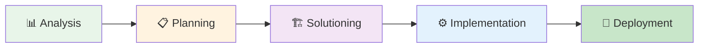
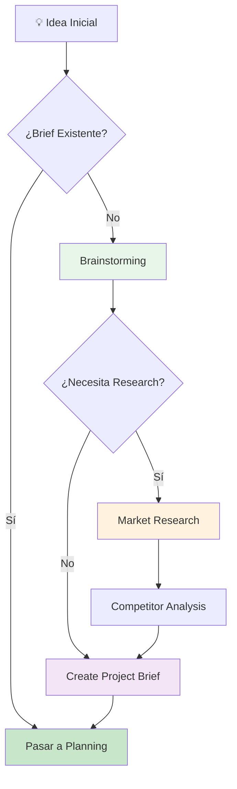
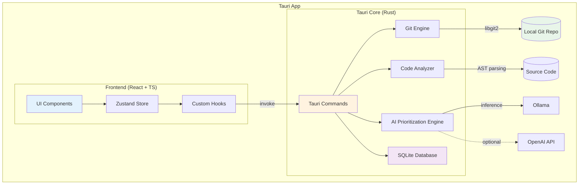
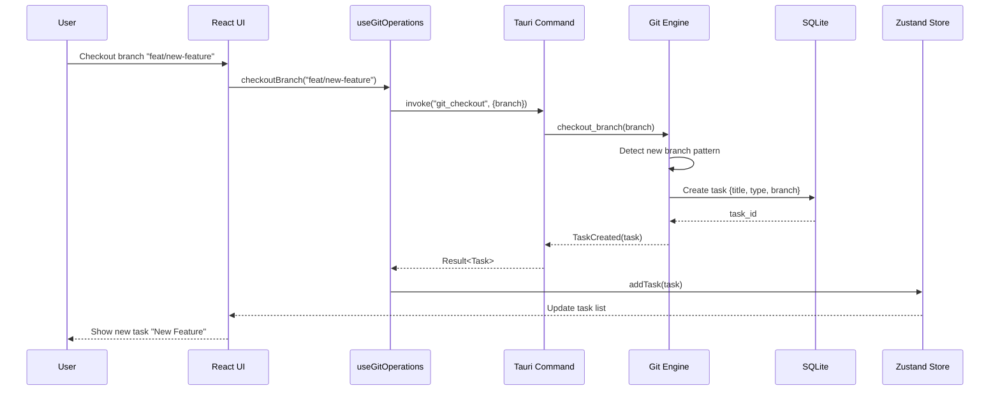
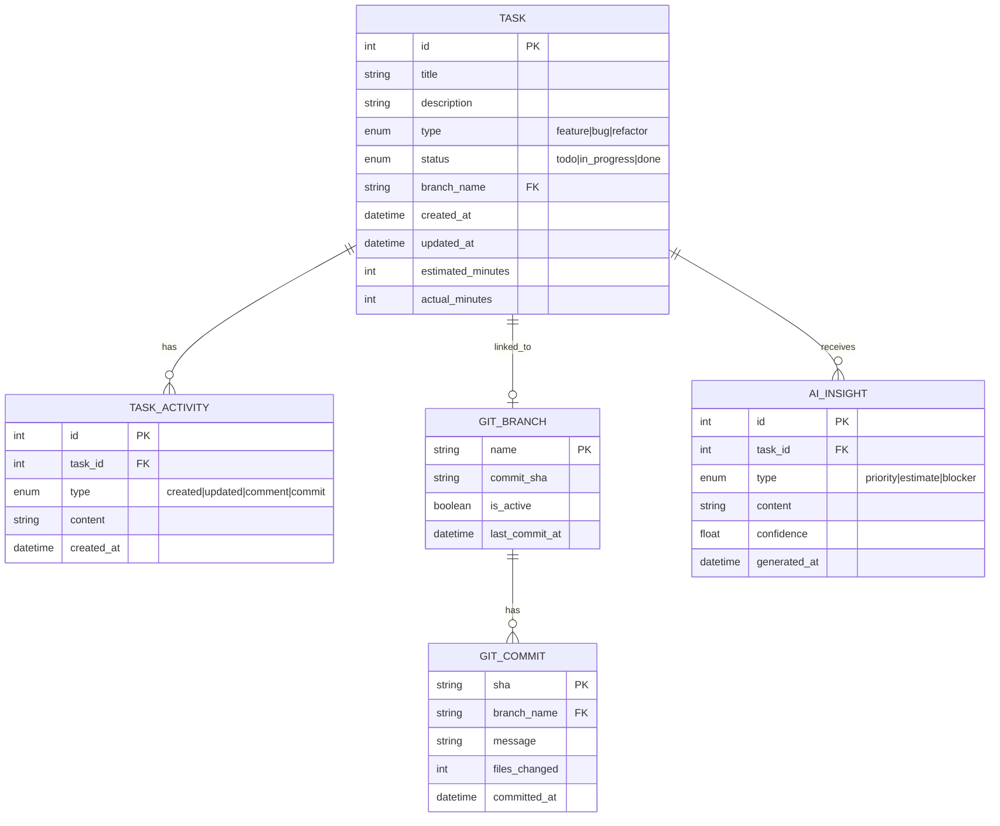
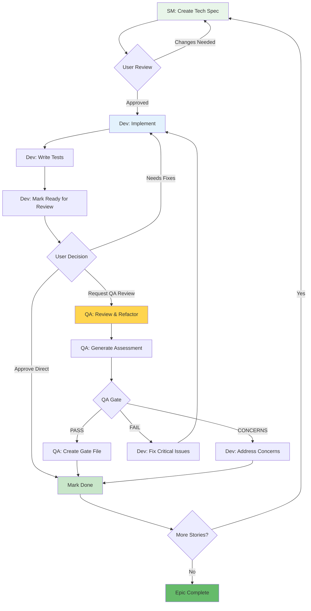
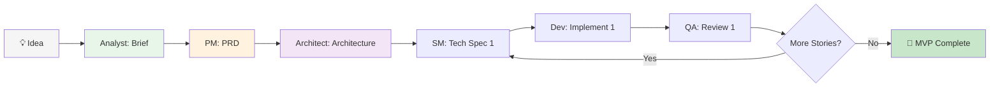
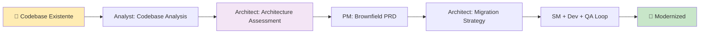
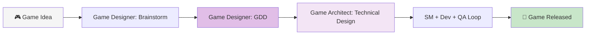

# Capítulo 13: BMAD Method v6 con Claude Code

**Duración estimada**: 2.5 - 3 horas
**Nivel de dificultad**: Avanzado
**Prerequisitos**: Capítulos 1-12 completados

---

## 📋 Descripción

Este capítulo te enseñará el **BMAD Method v6** (Breakthrough Method of Agile AI-Driven Development), una metodología revolucionaria para desarrollo ágil asistido por IA, específicamente integrada con **Claude Code**.

BMAD no es solo una herramienta más - es un framework completo que transforma cómo desarrollas software mediante la **amplificación humana**, no el reemplazo. Aprenderás a colaborar con agentes IA especializados que actúan como coaches expertos guiándote a través de workflows estructurados desde la ideación hasta el deployment.

---

## 🎯 Objetivos de Aprendizaje

Al completar este capítulo, serás capaz de:

1. ✅ Comprender la filosofía BMAD-CORE y el Scale Adaptive Workflow Engine
2. ✅ Instalar y configurar BMAD Method v6 con Claude Code
3. ✅ Ejecutar la **Fase 1: Analysis** con el agente Analyst
4. ✅ Ejecutar la **Fase 2: Planning** con el agente PM
5. ✅ Ejecutar la **Fase 3: Solutioning** con el agente Architect
6. ✅ Ejecutar la **Fase 4: Implementation** con el ciclo SM → Dev → QA
7. ✅ Usar agentes BMAD como slash commands en Claude Code
8. ✅ Implementar workflows completos para proyectos Greenfield y Brownfield
9. ✅ Crear agentes personalizados con BMad Builder (BMB)
10. ✅ Optimizar tu configuración BMAD para máxima efectividad
11. ✅ Ejecutar un proyecto completo de principio a fin con BMAD v6
12. ✅ Integrar Test Architect (QA) para quality gates automáticos

---

## 📚 Índice de Contenidos

- [13.1 - Introducción al BMAD Method v6](#131---introducción-al-bmad-method-v6)
- [13.2 - Instalación y Configuración](#132---instalación-y-configuración)
- [13.3 - Fase 1: Analysis (Análisis)](#133---fase-1-analysis-análisis)
- [13.4 - Fase 2: Planning (Planificación)](#134---fase-2-planning-planificación)
- [13.5 - Fase 3: Solutioning (Arquitectura)](#135---fase-3-solutioning-arquitectura)
- [13.6 - Fase 4: Implementation (Desarrollo)](#136---fase-4-implementation-desarrollo)
- [13.7 - Agentes BMAD en Claude Code](#137---agentes-bmad-en-claude-code)
- [13.8 - Flujos de Trabajo Prácticos](#138---flujos-de-trabajo-prácticos)
- [13.9 - BMad Builder (BMB) - Personalización](#139---bmad-builder-bmb---personalización)
- [13.10 - Optimización y Mejores Prácticas](#1310---optimización-y-mejores-prácticas)
- [13.11 - Ejercicios Prácticos](#1311---ejercicios-prácticos)
- [13.12 - Examen Final](#1312---examen-final)

---

# 13.1 - Introducción al BMAD Method v6

## ¿Qué es BMAD Method?

**BMAD** (Breakthrough Method of Agile AI-Driven Development) es un framework universal que transforma la colaboración humano-IA en desarrollo de software. No es una herramienta que "hace el trabajo por ti" - es un sistema que **amplifica tu capacidad de pensar, diseñar e implementar soluciones excepcionales**.

### La Filosofía BMAD-CORE

En el corazón de BMAD v6 está **BMAD-CORE** (Collaboration Optimized Reflection Engine):

```
┌─────────────────────────────────────────────────┐
│         BMAD-CORE Philosophy                    │
├─────────────────────────────────────────────────┤
│ C - Collaboration   │ Humano + IA trabajando    │
│                     │ como socios iguales       │
├─────────────────────┼───────────────────────────┤
│ O - Optimized       │ Procesos refinados para   │
│                     │ máxima efectividad        │
├─────────────────────┼───────────────────────────┤
│ R - Reflection      │ Pensamiento guiado que    │
│                     │ descubre mejores insights │
├─────────────────────┼───────────────────────────┤
│ E - Engine          │ Framework que orquesta    │
│                     │ agentes especializados    │
└─────────────────────┴───────────────────────────┘
```

### Amplificación vs. Reemplazo

| **IA Tradicional**                    | **BMAD Method**                        |
|---------------------------------------|----------------------------------------|
| Hace el pensamiento por ti            | Te guía para pensar mejor              |
| Genera respuestas promedio            | Facilita descubrimiento de soluciones  |
| Sustituye tu habilidad                | Amplifica tu potencial natural         |
| Output genérico                       | Soluciones personalizadas              |
| Sin contexto del proyecto             | Contexto profundo integrado            |

### Scale Adaptive Workflow Engine™

Una de las innovaciones clave de v6 es el **Scale Adaptive Workflow Engine**. El sistema evalúa tu proyecto y adapta los workflows automáticamente:

```yaml
Project Assessment:
  Scope: Simple | Small | Medium | Large | Complex
  Codebase: Greenfield | Brownfield-Good | Brownfield-Legacy
  Team Size: Solo | Small | Medium | Large
  Domain: Web | Mobile | Game | Embedded | Cloud | etc.

Scale Level (0-4):
  0: Simple task    → Tech spec only
  1: Small project  → Lightweight PRD + Quick arch
  2: Medium project → Full PRD + Standard arch
  3: Large project  → Detailed PRD + Comprehensive arch
  4: Complex system → Multi-phase planning + Advanced arch
```

El workflow se adapta a tu **nivel de escala**, no al revés.

## Los 4 Módulos de BMAD v6

BMAD v6 se compone de módulos especializados:

### 1. **CORE** - El Motor Base
- Orquestación de agentes
- Sistema de templates
- Dependency management
- Knowledge base (KB)

### 2. **BMM** (BMad Method) - Desarrollo de Software
- Agentes: Analyst, PM, Architect, SM, Dev, QA, PO
- 4 Fases: Analysis → Planning → Solutioning → Implementation
- Game Development support (GDD workflows)
- Scale Adaptive workflows

### 3. **BMB** (BMad Builder) - Personalización
- Agent builder
- Workflow creator
- Custom module generator
- Standalone tiny agents

### 4. **CIS** (Creative Intelligence Suite)
- Brainstorming avanzado
- Problem-solving frameworks
- Innovation workflows
- Creative thinking tools

> **Nota**: En este capítulo nos enfocaremos principalmente en **BMM** (BMad Method) para desarrollo de software con Claude Code.

## Las 4 Fases del BMAD Method

El BMM sigue un workflow estructurado de 4 fases:



### Fase 1: Analysis (Análisis)
- **Agente**: Analyst
- **Output**: Project Brief / Game Brief
- **Actividades**: Brainstorming, market research, competitor analysis
- **Duración**: Variable según complejidad

### Fase 2: Planning (Planificación)
- **Agente**: PM (Product Manager) / Game Designer
- **Output**: PRD (Product Requirements Document) o GDD (Game Design Document)
- **Actividades**: Define FRs, NFRs, epics, stories
- **Duración**: Scale-adaptive (30 min - 4 horas)

### Fase 3: Solutioning (Arquitectura)
- **Agente**: Architect / Game Architect
- **Output**: Architecture Document (adaptativo al tipo de proyecto)
- **Actividades**: Tech stack, system design, patterns, infrastructure
- **Duración**: Scale-adaptive (45 min - 6 horas)

### Fase 4: Implementation (Desarrollo)
- **Agentes**: SM (Scrum Master), Dev (Developer), QA (Test Architect)
- **Output**: Working software + tests + documentation
- **Actividades**: Ciclo iterativo de stories con quality gates
- **Duración**: Depende del proyecto (días a meses)

## ¿Por Qué BMAD con Claude Code?

Claude Code es el IDE perfecto para BMAD Method por varias razones:

1. **Contexto Profundo**: Claude mantiene contexto extenso de tu proyecto
2. **Herramientas Integradas**: Read, Edit, Write, Bash - todo lo que BMAD necesita
3. **Sub-agentes Nativos**: Claude Code tiene soporte nativo para agentes especializados
4. **Slash Commands**: Perfectos para activar agentes BMAD
5. **MCP Support**: Integración con servidores externos
6. **Git Integration**: Commits y PRs integrados en el workflow

---

# 13.2 - Instalación y Configuración

## Prerequisitos

Antes de instalar BMAD Method, asegúrate de tener:

```bash
✅ Node.js >= 20.0.0
✅ npm >= 9.0.0
✅ Git configurado
✅ Claude Code instalado y funcionando
```

Verifica tus versiones:

```bash
node --version  # Debe ser >= v20.0.0
npm --version   # Debe ser >= 9.0.0
git --version   # Cualquier versión moderna
```

## Instalación de BMAD Method v6

### Opción 1: Instalación Interactiva (Recomendada)

Navega a la carpeta de tu proyecto (o crea una nueva):

```bash
# Crear proyecto nuevo
mkdir mi-proyecto-bmad
cd mi-proyecto-bmad

# O navegar a proyecto existente
cd /ruta/a/tu/proyecto
```

Ejecuta el instalador:

```bash
npx bmad-method install
```

El instalador te hará varias preguntas:

```
🎯 BMAD Method v6 - Installation Wizard

📁 Destination path:
   → /home/user/mi-proyecto-bmad

👤 Your name (for authorship):
   → Tu Nombre

🌐 Agent communication language:
   → Spanish

📦 Select modules to install:
   ☑ CORE (required)
   ☑ BMM (BMad Method - Software Development)
   ☐ BMB (BMad Builder - Agent Creation)
   ☐ CIS (Creative Intelligence Suite)

🔧 IDE Selection:
   ☑ Claude Code

⚙️ Claude Code specific options:
   ☑ Install pre-configured sub-agents
   ☑ Install slash commands for BMAD agents

✨ Installation complete!
```

### Opción 2: Instalación No-Interactiva

Si ya sabes qué quieres instalar:

```bash
npx bmad-method install \
  --name "Tu Nombre" \
  --lang es \
  --modules bmm \
  --ide claude-code \
  --claude-subagents
```

## Estructura de Carpetas Generada

Después de la instalación, tu proyecto tendrá esta estructura:

```
mi-proyecto-bmad/
├── bmad/                          # Todo BMAD vive aquí
│   ├── core/                      # BMAD-CORE engine
│   │   ├── agents/                # Definiciones de agentes
│   │   ├── tasks/                 # Tareas reutilizables
│   │   ├── templates/             # Templates de documentos
│   │   ├── workflows/             # Definiciones de workflows
│   │   ├── data/                  # Knowledge base
│   │   │   ├── bmad-kb.md        # KB principal
│   │   │   └── technical-preferences.md
│   │   └── utils/                 # Utilidades
│   ├── bmm/                       # BMad Method module
│   │   ├── agents/                # Analyst, PM, Arch, SM, Dev, QA
│   │   ├── workflows/             # Greenfield, Brownfield, etc.
│   │   └── tasks/                 # BMM-specific tasks
│   ├── _cfg/                      # Configuración personalizable
│   │   ├── agents/                # Customización de agentes
│   │   │   ├── analyst.yaml
│   │   │   ├── pm.yaml
│   │   │   ├── architect.yaml
│   │   │   ├── sm.yaml
│   │   │   ├── dev.yaml
│   │   │   └── qa.yaml
│   │   └── core-config.yaml       # Configuración principal
│   └── party.md                   # Party mode config
│
├── docs/                          # Documentos del proyecto
│   ├── prd.md                     # Product Requirements (se genera)
│   ├── architecture.md            # Architecture doc (se genera)
│   ├── epics/                     # Epics sharded (opcional en v6)
│   ├── stories/                   # User stories (se generan)
│   └── qa/                        # QA artifacts
│       ├── assessments/           # Risk, test design, etc.
│       └── gates/                 # Quality gates
│
├── .claude/                       # Claude Code config (si seleccionaste)
│   ├── commands/                  # Slash commands
│   │   ├── analyst.md
│   │   ├── pm.md
│   │   ├── architect.md
│   │   ├── sm.md
│   │   ├── dev.md
│   │   └── qa.md
│   └── subagents/                 # Sub-agentes (opcional)
│       ├── analyst.md
│       ├── pm.md
│       └── etc...
│
├── src/                           # Tu código (se crea durante dev)
├── tests/                         # Tests (se crean durante dev)
│
├── package.json                   # Incluye scripts BMAD
├── .gitignore                     # Actualizado para BMAD
└── README.md                      # Actualizado con info BMAD
```

## Configuración Inicial

### 1. Technical Preferences

Edita `bmad/core/data/technical-preferences.md` para definir tus preferencias técnicas:

```markdown
# Technical Preferences

## Preferred Tech Stack

### Frontend
- Framework: React 18+ with TypeScript
- State: Zustand (not Redux)
- Styling: Tailwind CSS
- Build: Vite

### Backend
- Runtime: Node.js 20+
- Framework: Express.js
- Database: PostgreSQL 15+
- ORM: Prisma

### Testing
- Unit: Vitest
- E2E: Playwright
- Avoid: Jest (prefer Vitest)

## Design Patterns
- Prefer composition over inheritance
- Use dependency injection
- Repository pattern for data access
- Controller-Service-Repository architecture

## Anti-Patterns to Avoid
- ❌ God objects
- ❌ Tight coupling
- ❌ Hard-coded credentials
- ❌ Magic numbers without constants
```

Los agentes BMAD usarán estas preferencias al generar arquitecturas y código.

### 2. Core Config

Edita `bmad/_cfg/core-config.yaml`:

```yaml
# Core BMAD Configuration
version: "6.0"
language: "es"  # Idioma de comunicación de agentes

# Archivos que Dev agent debe cargar SIEMPRE
devLoadAlwaysFiles:
  - docs/architecture/coding-standards.md
  - docs/architecture/tech-stack.md
  - docs/architecture/project-structure.md

# Paths del proyecto
paths:
  docs: "docs"
  src: "src"
  tests: "tests"
  qaAssessments: "docs/qa/assessments"
  qaGates: "docs/qa/gates"

# Opciones de agentes
agents:
  incrementalMode: true  # Interactivo por defecto
  yoloMode: false        # Generación rápida sin interacción
```

### 3. Personalizar Agentes (Opcional)

Cada agente puede personalizarse editando su archivo en `bmad/_cfg/agents/`:

**Ejemplo**: `bmad/_cfg/agents/dev.yaml`

```yaml
# Personalización del Dev Agent
name: "Dev"  # Puedes cambiar el nombre
persona:
  greeting: "¡Hola! Soy tu desarrollador IA."
  style: "profesional y directo"
  tone: "amigable pero técnico"

preferences:
  codeStyle: "clean y bien comentado"
  testFirst: true
  commitMessages: "conventional commits"

languages:
  communication: "es"  # Español
  code: "en"           # Código en inglés
```

## Verificación de Instalación

Para verificar que todo está instalado correctamente:

```bash
# Ver scripts BMAD instalados
npm run

# Deberías ver:
# bmad:refresh    - Refresh BMAD configuration
# bmad:list       - List all BMAD agents
# bmad:validate   - Validate BMAD installation
```

Ejecuta la validación:

```bash
npm run bmad:validate
```

Output esperado:

```
✅ BMAD-CORE: Installed correctly
✅ BMM Module: Installed correctly
✅ Claude Code integration: Configured
✅ Agents available: 7
   - analyst
   - pm
   - architect
   - sm
   - dev
   - qa
   - po

🎉 BMAD Method v6 ready to use!
```

## Configuración de Claude Code

### Slash Commands

Si instalaste con `--claude-subagents`, tendrás slash commands disponibles:

```bash
# En Claude Code, puedes usar:
/analyst     # Activar Analyst agent
/pm          # Activar PM agent
/architect   # Activar Architect agent
/sm          # Activar Scrum Master agent
/dev         # Activar Dev agent
/qa          # Activar QA agent
/po          # Activar Product Owner agent
```

### Sub-agentes (Opcional)

Los sub-agentes están en `.claude/subagents/`. Claude Code puede invocarlos automáticamente cuando detecta contexto apropiado.

### Party Mode

Party mode permite simular múltiples agentes en una conversación:

```bash
# En Claude Code:
Hey Claude, activa party mode y simula una retrospective
con todos los agentes BMAD
```

Claude leerá `bmad/party.md` y simulará todos los agentes definidos.

---

# 13.3 - Fase 1: Analysis (Análisis)

La **Fase de Análisis** es donde tu proyecto cobra vida. El agente **Analyst** te guía desde una idea vaga hasta un **Project Brief** sólido que sirve como fundación para todo el proyecto.

## Objetivos de la Fase de Análisis

- 🎯 Clarificar la visión del proyecto
- 🔍 Validar la viabilidad de la idea
- 📊 Entender el mercado y usuarios
- 🏆 Identificar diferenciadores clave
- 📝 Producir un Project Brief estructurado

## El Agente Analyst

El **Analyst** es tu consultor estratégico experto en:

- **Brainstorming**: Refinamiento de ideas mediante técnicas estructuradas
- **Market Research**: Investigación de mercado y tendencias
- **Competitor Analysis**: Análisis de competencia
- **User Research**: Definición de personas y necesidades
- **Product Brief Creation**: Síntesis de toda la investigación en un documento

## Workflow de Analysis



## 13.3.1 - Activar el Analyst Agent

En Claude Code, hay varias formas de activar al Analyst:

### Opción 1: Slash Command (Si instalaste sub-agents)

```bash
/analyst Quiero crear una aplicación de gestión de tareas
```

### Opción 2: Mención Directa

```bash
Hey Claude, activa el agente Analyst. Tengo una idea para
una aplicación que necesito explorar.
```

### Opción 3: Uso de Task Específica

```bash
@claude usa la task brainstorm-project del módulo BMM
```

El Analyst se presentará:

```
🔍 Analyst Agent Activado

¡Hola! Soy tu analista de producto IA. Mi rol es ayudarte a
transformar tu idea en un Project Brief sólido mediante:

1. Brainstorming estructurado
2. Investigación de mercado
3. Análisis de competencia
4. Definición de usuarios

¿En qué estás pensando? Cuéntame sobre tu idea...
```

## 13.3.2 - Brainstorming con Analyst

El Analyst usa técnicas de **Advanced Elicitation** (del módulo CIS) para explorar tu idea:

### Ejemplo de Sesión de Brainstorming

```
Usuario: Quiero crear una app de gestión de tareas, pero
diferente a lo que existe.

Analyst: Excelente inicio. Exploremos esto más profundo.

🎯 CLARIFICACIÓN INICIAL

1. ¿Cuál es el problema principal que resolverá tu app?
2. ¿Quiénes son los usuarios objetivo?
3. ¿Qué hace "diferente" a tu app vs. Todoist, Notion, etc.?

Usuario: Es para desarrolladores que trabajan con múltiples
proyectos y se pierden en el contexto switching. Integra
con Git para auto-detectar tareas del código.

Analyst: ¡Interesante! Problema real. Profundicemos:

🔍 EXPLORACIÓN DEL PROBLEMA

El "context switching" es costoso para devs. Tu app propone:
- Auto-detección de tareas desde Git commits/branches
- ¿También desde TODOs en código?
- ¿Integración con PR comments y issues?

Pensemos en el valor único:
- Todoist: Task management genérico
- Linear: Issues para equipos
- Tu App: Task management con contexto de código

¿Qué otras fuentes de "contexto" podríamos capturar?
- Stack traces de errores
- Time tracking por branch
- Context notes automáticos

Usuario: ¡Sí! Todo eso. Y también sugerencias de IA sobre
qué tarea hacer siguiente según energía/tiempo disponible.

Analyst: Perfecto. Estamos llegando a algo concreto.

📊 ESTRUCTURA EMERGENTE

Core Features:
1. Git Integration (commits, branches, PRs como fuente)
2. Code Analysis (TODOs, FIXMEs desde el código)
3. Context Preservation (notas automáticas al switch)
4. AI Task Prioritization (energía, tiempo, dependencies)
5. Time Tracking integrado por branch

Diferenciadores vs. Competencia:
- Único con true Git-native task detection
- AI que entiende contexto técnico, no solo deadlines
- Zero-friction: tasks emergen del trabajo, no input manual

¿Te parece que vamos en la dirección correcta?
```

### Técnicas de Brainstorming del Analyst

El Analyst usa 10 técnicas de elicitación:

| Técnica                   | Cuándo Usar                              |
|---------------------------|------------------------------------------|
| **Clarifying Questions**  | Idea inicial vaga                        |
| **Deep Dive**             | Explorar un aspecto específico           |
| **Challenge Assumptions** | Cuestionar creencias del usuario         |
| **Explore Alternatives**  | Considerar enfoques diferentes           |
| **Connect Concepts**      | Unir ideas dispersas                     |
| **Scenario Exploration**  | Visualizar uso real                      |
| **Risk Analysis**         | Identificar obstáculos potenciales       |
| **Expand Scope**          | Pensar más grande                        |
| **Narrow Focus**          | Simplificar cuando es necesario          |
| **Synthesize Insights**   | Consolidar lo aprendido                  |

## 13.3.3 - Market Research

Una vez clarificada la idea, el Analyst puede investigar el mercado:

```bash
Analyst: Ahora que tenemos claridad, hagamos research.

🔍 MARKET RESEARCH

Investigaré:
1. Tamaño del mercado de developer tools
2. Tendencias en productivity apps para devs
3. Análisis de competidores directos
4. Pain points reportados en forums/Reddit

¿Quieres que haga deep research automático, o prefieres
guiarme hacia fuentes específicas?
```

### Tipos de Research

**Opción A: Automático** (El Analyst usa web search)

```bash
/analyst research --mode auto --topic "developer task management apps"
```

**Opción B: Guiado** (Tú proporcionas fuentes)

```bash
Usuario: Investiga estos competidores específicos:
- Linear (linear.app)
- Height (height.app)
- Plane (plane.so)

Analyst: Perfecto. Analizaré sus features, pricing, y
diferenciadores. Dame un momento...

[Analyst usa WebFetch para obtener info de cada URL]

📊 ANÁLISIS DE COMPETIDORES

Linear:
- Foco: Issue tracking para equipos de software
- Features: Git integration, workflows, cycles
- Pricing: $8/user/month
- Fortaleza: UX excepcional, velocidad
- Debilidad: No task management personal, solo team

Height:
- Foco: Project management colaborativo
- Features: Spreadsheet meets task manager
- Pricing: $6.99/user/month
- Fortaleza: Flexible, múltiples vistas
- Debilidad: No Git integration profunda

Plane:
- Foco: Open-source project management
- Features: Issues, cycles, modules
- Pricing: Self-hosted free, cloud $8/user
- Fortaleza: Open source, customizable
- Debilidad: UI menos pulida que Linear

🎯 TU OPORTUNIDAD

Ninguno ofrece:
- True Git-native task extraction
- AI-powered context preservation
- Energy-based task prioritization

Gap de mercado validado ✅
```

## 13.3.4 - Crear el Project Brief

Con toda la información recolectada, el Analyst genera el **Project Brief**:

```bash
Analyst: Tengo toda la info necesaria. Voy a generar tu
Project Brief.

¿Prefieres modo incremental (reviso cada sección contigo)
o modo rápido (genero todo y lo revisas después)?

Usuario: Incremental

Analyst: Perfecto. Empecemos.

📝 GENERANDO PROJECT BRIEF

[El Analyst usa el template bmad/core/templates/brief-tmpl.md]
```

### Estructura del Project Brief

```markdown
# Project Brief: DevFlow (ejemplo)

## 1. Executive Summary

DevFlow es una aplicación de gestión de tareas diseñada
específicamente para desarrolladores que trabajan en
múltiples proyectos simultáneamente.

### El Problema
Los desarrolladores pierden 23% de su tiempo productivo
en context switching y re-familiarización con tareas
después de interrupciones.

### La Solución
DevFlow auto-detecta tareas desde Git (commits, branches,
PRs) y código (TODOs), preserva contexto al cambiar de tarea,
y usa IA para sugerir la próxima tarea óptima según energía
y tiempo disponible.

### Diferenciador Clave
Primera app de tasks verdaderamente Git-native con
AI context-aware prioritization.

## 2. Target Users

### Primary Persona: "Alex el Full-Stack Dev"
- Edad: 28-35
- Experiencia: 5-10 años
- Trabajo: 2-4 proyectos paralelos (freelance o startup)
- Pain: Constantemente interrumpido, olvida contexto
- Goal: Maximizar productividad en tiempo limitado

### Secondary Persona: "Sam el Tech Lead"
- Edad: 32-42
- Experiencia: 10+ años
- Trabajo: Coding + reviews + planning + meetings
- Pain: Fragmentación extrema del día
- Goal: Balance entre coding y management

## 3. Core Features (MVP)

### F1: Git-Native Task Detection
Auto-create tasks from:
- Branch names (feat/*, fix/*)
- Commit messages
- PR descriptions and review comments
- GitHub/GitLab issues

### F2: Code-Sourced Tasks
Scan code for:
- TODO comments
- FIXME annotations
- XXX markers
- Custom tags

### F3: Context Preservation
When switching tasks/branches:
- Auto-save open files
- Capture current mental context (user note)
- Screenshot option
- Branch state snapshot

### F4: AI Task Prioritization
Suggest next task based on:
- Estimated time vs. available time
- Current energy level (user input or time-of-day)
- Task dependencies (Git graph analysis)
- Deadlines/urgency

### F5: Time Tracking
- Automatic per-branch
- Manual override
- Integration with Git commits
- Weekly reports

## 4. Success Metrics

- User saves >30 min/day in context switching
- Task completion rate increases 40%
- User NPS > 50
- Daily active usage > 80% (sticky product)

## 5. Technical Constraints

- Must work offline (Git is local)
- Fast (<50ms UI response)
- Privacy-first (code never leaves machine)
- Cross-platform (Mac, Linux, Windows)

## 6. Market Validation

- TAM: 27M developers worldwide
- SAM: 8M devs working on multiple projects
- SOM: 500K early adopter devs (target Year 1)

Competitors: Linear ($8), Height ($7), Plane ($8)
Our pricing: $10/month (justified by AI + Git features)

## 7. Risks & Mitigation

| Risk | Impact | Mitigation |
|------|--------|------------|
| Git API complexity | High | Start with Git CLI |
| AI costs | Medium | Local LLM + optional cloud |
| Adoption friction | High | Free tier + onboarding |

## 8. Next Steps

1. Create PRD (Planning Phase)
2. Design architecture (Solutioning Phase)
3. Build MVP (Implementation Phase)
4. Beta with 100 users
5. Launch

---

Generated by BMAD Analyst Agent
Date: 2025-10-19
```

El Analyst guardará este brief en `docs/project-brief.md`.

## 13.3.5 - Variante: Game Brief

Si estás desarrollando un juego, el Analyst puede transformarse en **Game Designer**:

```bash
/analyst --mode game

Game Designer: ¡Hola! Veo que estás creando un juego.
Usaré el Game Brief template en lugar del Project Brief.

¿Qué tipo de juego tienes en mente?
- Genre (platformer, RPG, puzzle, etc.)
- Platform (mobile, PC, console, web)
- Target audience
- Core mechanic ideas
```

El Game Brief incluye secciones específicas:
- Core gameplay loop
- Art style direction
- Audio/music vision
- Monetization strategy (si aplica)
- Technical requirements (engine, platform, etc.)

---

## 📚 Resumen de la Fase Analysis

Después de completar la Fase 1, tendrás:

```
✅ Idea clarificada y validada
✅ Market research completado
✅ Competidores analizados
✅ Target users definidos
✅ Project Brief documentado en docs/project-brief.md
```

**Próximo paso**: Fase 2 - Planning con el agente PM.

---

**[Continuar a Sección 13.4 - Fase 2: Planning →](#134---fase-2-planning-planificación)**

---

# 13.4 - Fase 2: Planning (Planificación)

La **Fase de Planning** transforma tu Project Brief en un **PRD** (Product Requirements Document) detallado con functional requirements, non-functional requirements, epics, y user stories. Esta es la fase donde la visión se convierte en un plan ejecutable.

## Objetivos de la Fase de Planning

- 📋 Crear PRD estructurado y detallado
- 🎯 Definir Functional Requirements (FRs)
- ⚡ Definir Non-Functional Requirements (NFRs)
- 📦 Organizar features en Epics
- 📝 Desglosar Epics en User Stories
- 📊 Priorizar y estimar

## El Agente PM (Product Manager)

El **PM** es tu product manager IA experto en:

- **Requirements Elicitation**: Extraer requisitos detallados
- **Scale Adaptation**: Ajustar profundidad según complejidad del proyecto
- **Epic/Story Creation**: Descomposición estructurada de features
- **Prioritization**: Frameworks MoSCoW, RICE, Kano
- **PRD Documentation**: Generación de PRDs profesionales

## Scale Adaptive Planning

Una de las innovaciones de BMAD v6 es que el **PM ajusta automáticamente el nivel de detalle** según la escala de tu proyecto:

```yaml
Scale Assessment:
  Questions:
    - ¿Codebase nuevo o existente? (Greenfield/Brownfield)
    - ¿Complejidad? (Simple/Small/Medium/Large/Complex)
    - ¿Equipo? (Solo/Small/Medium/Large)
    - ¿Timeline? (Days/Weeks/Months/Year+)

  Scale Level Output:
    0: Simple Task    → Tech spec only (skip PRD)
    1: Small Project  → Lightweight PRD (1-2 pages)
    2: Medium Project → Standard PRD (5-10 pages)
    3: Large Project  → Detailed PRD (15-25 pages)
    4: Complex System → Comprehensive PRD (30+ pages)
```

El PM hace estas preguntas **automáticamente** al inicio.

## 13.4.1 - Activar el PM Agent

### Iniciar Planning Phase

```bash
# Opción 1: Slash command
/pm Crea un PRD basado en docs/project-brief.md

# Opción 2: Task workflow
/pm plan-project

# Opción 3: Mención directa
Hey Claude, necesito que como PM agent crees el PRD
para mi proyecto DevFlow.
```

El PM se presentará:

```
📋 PM Agent Activado

¡Hola! Soy tu Product Manager IA. Voy a guiarte en la
creación de un PRD profesional para tu proyecto.

Veo que tienes un Project Brief en docs/project-brief.md.
Perfecto, eso me da una excelente base.

Antes de empezar, necesito entender la escala de tu proyecto...

🔍 SCALE ASSESSMENT

1. ¿Estás comenzando de cero o tienes código existente?
   a) Greenfield (nuevo proyecto)
   b) Brownfield - Good (código existente bien estructurado)
   c) Brownfield - Legacy (código existente que necesita refactor)

2. ¿Cómo describes la complejidad del proyecto?
   a) Simple (1-2 features, 1-2 semanas)
   b) Small (3-5 features, 1 mes)
   c) Medium (5-10 features, 2-3 meses)
   d) Large (10-20 features, 6+ meses)
   e) Complex (20+ features, múltiples integraciones, 1 año+)

3. ¿Tamaño del equipo?
   a) Solo
   b) 2-3 personas
   c) 4-7 personas
   d) 8+ personas
```

### Ejemplo de Interacción

```
Usuario: a) Greenfield, c) Medium, a) Solo

PM: Perfecto. Basado en tus respuestas:

📊 SCALE DETERMINATION

Project Scale: Level 2 (Medium Project)

Esto significa que crearé:
- Standard PRD (5-10 pages)
- 5-10 Functional Requirements detallados
- 4-6 Non-Functional Requirements
- 3-5 Epics
- 15-25 User Stories

Tiempo estimado de planning: 45-60 minutos

¿Prefieres modo incremental (reviso cada sección contigo)
o modo rápido (genero todo y revisamos después)?

Usuario: Incremental

PM: Excelente. Empecemos con los Functional Requirements.
```

## 13.4.2 - Functional Requirements (FRs)

El PM extrae y estructura los FRs desde tu Project Brief:

```
PM: Basado en tu brief, identifiqué 5 core features.
Voy a crear Functional Requirements detallados para cada uno.

📋 FUNCTIONAL REQUIREMENT 1: GIT-NATIVE TASK DETECTION

FR-1.1: Branch-Based Task Creation
Description:
  El sistema debe auto-crear tareas cuando el usuario
  crea o cambia a una branch de Git que siga convenciones:
  - feat/* → Feature task
  - fix/* → Bug fix task
  - refactor/* → Refactoring task

Acceptance Criteria:
  ✅ Task se crea automáticamente al checkout de nueva branch
  ✅ Task title extraído del branch name (kebab-case → Title Case)
  ✅ Task type inferido del prefix (feat/fix/refactor)
  ✅ Task se asocia con el branch para tracking
  ✅ Al mergear el branch, task se marca como completada

Priority: P0 (Must Have)
Effort: Medium (3-5 days)

FR-1.2: Commit-Based Task Updates
Description:
  El sistema debe actualizar tareas existentes cuando
  el usuario hace commits relacionados.

Acceptance Criteria:
  ✅ Commits con "refs #123" actualizan tarea 123
  ✅ Se agrega commit message como activity en la tarea
  ✅ Se extrae tiempo aproximado del commit (files changed)
  ✅ Se detectan keywords (WIP, DONE) para cambiar estado

Priority: P1 (Should Have)
Effort: Small (1-2 days)

[...]

¿Te parece bien la estructura de FR-1? ¿Algún ajuste?
```

El usuario puede:
- ✅ Aprobar y continuar
- 📝 Pedir modificaciones
- ➕ Agregar criterios adicionales
- 🔄 Re-generar con diferente enfoque

### Formato de FRs

```markdown
## FR-X: [TÍTULO DEL REQUIREMENT]

**Description**: Qué debe hacer el sistema

**Rationale**: Por qué es importante (business value)

**Acceptance Criteria**:
- ✅ Criterio 1 (medible, verificable)
- ✅ Criterio 2
- ✅ Criterio N

**Priority**: P0 | P1 | P2 (MoSCoW: Must/Should/Could)

**Effort**: Small (1-2d) | Medium (3-5d) | Large (1-2w) | XL (2w+)

**Dependencies**: [Lista de otros FRs que deben completarse primero]

**Risks**: [Riesgos potenciales de implementación]

**User Story References**: [Links a stories que implementan este FR]
```

## 13.4.3 - Non-Functional Requirements (NFRs)

Los NFRs definen **cómo debe comportarse el sistema** (no qué debe hacer):

```
PM: Ahora los Non-Functional Requirements.

⚡ NFR-1: PERFORMANCE

NFR-1.1: UI Responsiveness
  Requirement:
    La interfaz debe responder a interacciones del usuario
    en <50ms en el 95% de los casos.

  Measurement:
    - Tiempo desde click a feedback visual: <50ms p95
    - Task list render time: <100ms para 1000 tasks
    - Search results: <200ms para 10K tasks

  Testing Strategy:
    - Performance tests con Playwright (browser.cpuThrottling)
    - Benchmark suite en CI
    - RUM (Real User Monitoring) en producción

NFR-1.2: Git Operations Speed
  Requirement:
    Operaciones de Git (scan branches, read commits) deben
    completarse en background sin bloquear UI.

  Measurement:
    - Git scan: <2s para repo con 500 branches
    - UI permanece responsive durante scan
    - Progress indicator si >500ms

  Testing Strategy:
    - Mock Git repos grandes
    - Test con real repos (Linux kernel: 1M commits)

🔒 NFR-2: SECURITY

NFR-2.1: Data Privacy
  Requirement:
    El código del usuario NUNCA debe salir de la máquina
    local, excepto si el usuario explícitamente habilita
    cloud sync (opt-in).

  Measurement:
    - Network audit: 0 calls a backend con código
    - Solo telemetry anónima (opt-in)
    - HTTPS para cualquier network call

  Testing Strategy:
    - Network mocking tests
    - Security audit con OWASP guidelines
    - Penetration testing (opt-in beta users)

[...]

¿Los NFRs reflejan tus estándares de calidad?
```

### Categorías Comunes de NFRs

| Categoría            | Ejemplos                                  |
|----------------------|-------------------------------------------|
| **Performance**      | Response time, throughput, latency        |
| **Security**         | Authentication, encryption, audit logs    |
| **Reliability**      | Uptime, error rate, recovery time         |
| **Scalability**      | Max users, data volume, load handling     |
| **Usability**        | Learnability, accessibility, i18n         |
| **Maintainability**  | Code quality, test coverage, documentation|
| **Compatibility**    | Browser support, OS support, APIs         |
| **Compliance**       | GDPR, HIPAA, SOC2, accessibility (WCAG)   |

## 13.4.4 - Epics y User Stories

El PM organiza los FRs en **Epics** (grupos de funcionalidad relacionada) y luego descompone cada Epic en **User Stories** (unidades implementables):

```
PM: Ahora voy a organizar los FRs en Epics.

📦 EPIC STRUCTURE

Epic 1: Git Integration Core
  Scope: FR-1 (Git-Native Task Detection)
  Stories: 8 stories
  Effort: 2-3 sprints

Epic 2: Code Analysis Engine
  Scope: FR-2 (Code-Sourced Tasks)
  Stories: 5 stories
  Effort: 1-2 sprints

Epic 3: Context Preservation System
  Scope: FR-3 (Context Preservation)
  Stories: 6 stories
  Effort: 1-2 sprints

Epic 4: AI Task Prioritization
  Scope: FR-4 (AI Prioritization)
  Stories: 7 stories
  Effort: 2 sprints

Epic 5: Time Tracking & Analytics
  Scope: FR-5 (Time Tracking)
  Stories: 4 stories
  Effort: 1 sprint

Total: 30 stories, ~7-10 sprints (3.5-5 months @ 2-week sprints)

¿Tiene sentido esta estructura de Epics?
```

### Desglose de Epic en Stories

```
PM: Voy a desglosar Epic 1 en User Stories.

📦 EPIC 1: GIT INTEGRATION CORE

┌─────────────────────────────────────────────────────────┐
│ Story 1.1: Branch-Based Task Auto-Creation             │
├─────────────────────────────────────────────────────────┤
│ As a developer                                          │
│ I want tasks to be automatically created from branches  │
│ So that I don't have to manually create tasks          │
│                                                         │
│ Acceptance Criteria:                                    │
│ ✅ When I create feat/* branch, task auto-created      │
│ ✅ Task title extracted from branch name               │
│ ✅ Task type set based on prefix (feat/fix/refactor)   │
│ ✅ Task linked to branch for tracking                  │
│                                                         │
│ Technical Notes:                                        │
│ - Use Git hooks (post-checkout)                        │
│ - Parse branch name: feat/user-authentication          │
│   → "User Authentication" (task title)                 │
│ - Store branch → task mapping in local DB              │
│                                                         │
│ Effort: 3 points (Medium)                              │
│ Priority: P0 (Must Have for MVP)                       │
│ Dependencies: None                                      │
└─────────────────────────────────────────────────────────┘

┌─────────────────────────────────────────────────────────┐
│ Story 1.2: Commit Message Task Updates                 │
├─────────────────────────────────────────────────────────┤
│ As a developer                                          │
│ I want my commit messages to update related tasks       │
│ So that task progress reflects my actual work          │
│                                                         │
│ Acceptance Criteria:                                    │
│ ✅ Commit with "refs #123" updates task 123            │
│ ✅ Commit message added as activity log                │
│ ✅ Commit timestamp recorded                           │
│ ✅ Files changed count extracted                       │
│                                                         │
│ Technical Notes:                                        │
│ - Use Git hooks (post-commit)                          │
│ - Parse commit message for references                  │
│ - Extract metadata: git show --stat HEAD               │
│                                                         │
│ Effort: 2 points (Small)                               │
│ Priority: P1 (Should Have)                             │
│ Dependencies: Story 1.1                                 │
└─────────────────────────────────────────────────────────┘

[... 6 more stories for Epic 1 ...]

¿Las stories son lo suficientemente específicas para
que el Dev agent pueda implementarlas?
```

### Story Format (User Story Template)

```markdown
## Story X.Y: [TÍTULO]

**As a** [role]
**I want** [feature]
**So that** [benefit]

**Acceptance Criteria**:
- ✅ [Criterio 1 - testable, específico]
- ✅ [Criterio 2]
- ✅ [Criterio N]

**Technical Notes**:
- Implementation hints
- Architecture decisions
- API contracts
- Data models

**Effort**: [Points: 1, 2, 3, 5, 8, 13]
**Priority**: P0 | P1 | P2
**Dependencies**: [Story X.Y, Story Z.W]
**Risk Level**: Low | Medium | High

**Definition of Done**:
- [ ] Code implemented
- [ ] Unit tests written (>80% coverage)
- [ ] Integration tests written
- [ ] Documentation updated
- [ ] Code reviewed
- [ ] Deployed to staging
```

## 13.4.5 - Generación del PRD Completo

Una vez validados todos los componentes, el PM genera el PRD completo:

```
PM: Perfecto. Tengo todo lo necesario. Voy a generar
el PRD completo en docs/prd.md

📝 GENERANDO PRD...

Estructura:
1. Executive Summary
2. Goals & Success Metrics
3. Target Users & Personas
4. Functional Requirements (5 FRs detallados)
5. Non-Functional Requirements (6 NFRs)
6. Epic Structure (5 Epics)
7. User Stories (30 stories agrupadas por Epic)
8. Prioritization Matrix
9. Release Plan (MVP → V1.0 → V2.0)
10. Risks & Mitigation
11. Appendix (Glossary, References)

Generating... ████████████████ 100%

✅ PRD generated: docs/prd.md
```

### PRD Final Structure

```markdown
# Product Requirements Document: DevFlow

**Version**: 1.0
**Date**: 2025-10-19
**Author**: PM Agent (BMAD Method v6)
**Status**: Approved

---

## 1. Executive Summary

[Resumen del producto, problema, solución, diferenciador]

## 2. Goals & Success Metrics

### Business Goals
- Goal 1: Acquire 500 users in first 3 months
- Goal 2: 80% daily active usage (DAU)
- Goal 3: NPS > 50

### Success Metrics
| Metric | Target | Measurement |
|--------|--------|-------------|
| Time saved per day | >30 min | User survey + usage data |
| Task completion rate | +40% | Before/after comparison |
| Context switch time | <30s | App telemetry |

## 3. Target Users

[Personas detalladas de section 13.3.4]

## 4. Functional Requirements

### FR-1: Git-Native Task Detection
[Detalles completos de FR-1 con todos sus sub-requirements]

### FR-2: Code-Sourced Tasks
[...]

[... Total 5 FRs ...]

## 5. Non-Functional Requirements

### NFR-1: Performance
[Detalles completos]

### NFR-2: Security
[...]

[... Total 6 NFRs ...]

## 6. Epic Structure

### Epic 1: Git Integration Core
**Scope**: FR-1
**Stories**: 8 stories (Story 1.1 - 1.8)
**Effort**: 21 story points (~2-3 sprints)
**Priority**: P0 (Must Have for MVP)

**Stories**:
- Story 1.1: Branch-Based Task Auto-Creation (3 pts)
- Story 1.2: Commit Message Task Updates (2 pts)
- Story 1.3: PR Integration (5 pts)
- Story 1.4: Multiple Git Provider Support (3 pts)
- Story 1.5: Branch Cleanup Detection (2 pts)
- Story 1.6: Merge Conflict Task Creation (3 pts)
- Story 1.7: Git Hooks Configuration (2 pts)
- Story 1.8: Git Operations Error Handling (1 pt)

[... Epics 2-5 ...]

## 7. User Stories (Detailed)

[Todas las 30 stories en formato completo con acceptance criteria]

## 8. Prioritization Matrix

| Epic | Priority | Effort | Value | Risk | Order |
|------|----------|--------|-------|------|-------|
| Epic 1 | P0 | High | High | Medium | 1 |
| Epic 2 | P0 | Medium | High | Low | 2 |
| Epic 3 | P1 | Medium | Medium | Medium | 3 |
| Epic 4 | P1 | High | High | High | 4 |
| Epic 5 | P2 | Low | Low | Low | 5 |

## 9. Release Plan

### MVP (V0.9) - Month 3
- Epic 1: Git Integration Core ✅
- Epic 2: Code-Sourced Tasks ✅
- Epic 3: Context Preservation (partial) 🟡

### V1.0 - Month 5
- Epic 3: Context Preservation (complete) ✅
- Epic 4: AI Task Prioritization ✅

### V2.0 - Month 8
- Epic 5: Time Tracking ✅
- Epic 6: Team Collaboration (new) ✅

## 10. Risks & Mitigation

[De section 13.3.4, expandido]

## 11. Appendix

### Glossary
- **Branch**: Git branch
- **Context**: Current working state (files, mental notes)
[...]

### References
- [Git Hooks Documentation](https://git-scm.com/docs/githooks)
- [Similar Tools Analysis](docs/competitor-analysis.md)

---

Generated by BMAD PM Agent v6
Project Scale: Level 2 (Medium)
```

## 13.4.6 - Validación con Product Owner

Opcionalmente, puedes invocar al **PO (Product Owner)** agent para validar el PRD:

```bash
/po validate-prd docs/prd.md
```

```
🎯 PO Agent Activado

Voy a revisar tu PRD usando el Master Checklist.

📋 VALIDATION CHECKLIST

✅ Executive Summary is clear and compelling
✅ Goals are SMART (Specific, Measurable, Achievable, Relevant, Time-bound)
✅ Target users are well-defined with personas
✅ FRs are complete and testable
✅ NFRs are measurable
✅ Epics are properly scoped
✅ Stories follow INVEST principles
✅ Dependencies are mapped
✅ Priorities are justified
✅ Release plan is realistic

⚠️ WARNINGS (2):

1. Epic 4 (AI Prioritization) has HIGH risk but is P1.
   Consider: Move to V2.0 or reduce scope for MVP.

2. Story 4.3 lacks acceptance criteria for AI accuracy.
   Add: "AI suggestions are relevant >70% of cases (user feedback)"

Overall Score: 9/10 (Excellent)

Recommendation: APPROVED with minor adjustments suggested.
```

## 📚 Resumen de la Fase Planning

Después de completar la Fase 2, tendrás:

```
✅ Project Brief transformado en PRD detallado
✅ 5-10 Functional Requirements documentados
✅ 4-6 Non-Functional Requirements definidos
✅ 3-5 Epics estructurados
✅ 15-30 User Stories listas para implementar
✅ Priorización y release plan definidos
✅ PRD validado en docs/prd.md
```

**Próximo paso**: Fase 3 - Solutioning con el agente Architect.

---

# 13.5 - Fase 3: Solutioning (Arquitectura)

La **Fase de Solutioning** convierte tu PRD en una **Architecture Document** técnica que define **cómo** se construirá el sistema. El agente **Architect** diseña la solución técnica adaptada al tipo de proyecto, tech stack, y constraints.

## Objetivos de la Fase de Solutioning

- 🏗️ Diseñar la arquitectura del sistema
- 🛠️ Seleccionar el tech stack apropiado
- 📐 Definir patterns y principles
- 🔌 Diseñar integraciones y APIs
- 🗄️ Modelar datos
- 🚀 Planear infrastructure y deployment

## El Agente Architect

El **Architect** es tu arquitecto de software IA experto en:

- **System Design**: Arquitecturas escalables y maintainables
- **Tech Stack Selection**: Basado en tus technical preferences
- **Pattern Application**: Design patterns, SOLID, clean architecture
- **Integration Design**: APIs, third-party services, databases
- **Infrastructure Planning**: Cloud, deployment, CI/CD
- **Adaptive Documentation**: Arquitectura ajustada al tipo de proyecto

## Adaptive Architecture

En BMAD v6, la arquitectura **se adapta al tipo de proyecto**:

```yaml
Project Type Detection:
  Web Full-Stack:    Frontend + Backend + Database
  Web Frontend-Only: SPA/SSG without backend
  Web Backend-Only:  API/Service without UI
  Mobile Native:     iOS/Android native apps
  Mobile Hybrid:     React Native, Flutter
  Desktop:           Electron, Tauri
  CLI Tool:          Command-line application
  Library/SDK:       Reusable code package
  Game:              Unity, Unreal, Godot, etc.
  Embedded:          IoT, firmware
  Cloud Service:     Serverless, microservices

Architecture Sections Included:
  - Tech stack (ALWAYS)
  - System architecture diagram (ALWAYS)
  - Project type specific sections (ADAPTIVE)
  - Data models (if applicable)
  - API design (if applicable)
  - Infrastructure (if applicable)
  - etc.
```

## 13.5.1 - Activar el Architect Agent

```bash
# Opción 1: Slash command
/architect Design architecture from docs/prd.md

# Opción 2: Task workflow
/architect solution-architecture

# Opción 3: Mención directa
Hey Claude, como Architect agent, diseña la arquitectura
técnica para DevFlow basándote en el PRD.
```

El Architect se presenta:

```
🏗️ Architect Agent Activado

¡Hola! Soy tu Software Architect IA. Voy a diseñar la
arquitectura técnica para tu proyecto.

He leído tu PRD (docs/prd.md). Déjame entender mejor
el contexto técnico...

🔍 PROJECT TYPE DETECTION

Basado en el PRD:
- Features: Git integration, UI, local-first, AI
- Platform: Cross-platform desktop
- Users: Individual developers

Detected Project Type: Desktop Application (Electron/Tauri)

¿Es correcto? ¿O prefieres otro approach?
(ej: CLI tool, Web app, Native desktop)

Usuario: Correcto, pero prefiero Tauri sobre Electron
por performance y tamaño.

Architect: Perfecto. Tauri es excelente para apps nativas.

Ahora voy a revisar tus Technical Preferences...

📋 READING: bmad/core/data/technical-preferences.md

Veo tus preferencias:
- Frontend: React + TypeScript + Tailwind ✅
- State: Zustand ✅
- Build: Vite ✅
- Backend: Node.js + Express (no aplica para Tauri)
- Database: PostgreSQL (adaptaré a SQLite para local-first)
- Testing: Vitest + Playwright ✅

Voy a diseñar la arquitectura respetando tus preferencias
pero adaptándolas al contexto de Tauri.

¿Modo incremental o rápido?
```

## 13.5.2 - Tech Stack Selection

El Architect propone el tech stack basándose en:
1. Technical preferences del usuario
2. Tipo de proyecto detectado
3. Requirements del PRD (especialmente NFRs)
4. Industry best practices

```
Architect: Aquí está el tech stack propuesto.

🛠️ TECH STACK PROPOSAL

### Frontend (Tauri Window)
```yaml
Framework: React 18.2+ with TypeScript 5+
  Rationale: Tu preferencia + ecosystem maduro + TS safety
  Alternatives considered: Svelte (más ligero), Vue (similar)

State Management: Zustand
  Rationale: Tu preferencia + simple + performant
  Note: Zustand perfecto para Tauri (no async complexity de Redux)

UI Library: Tailwind CSS + Radix UI
  Rationale: Tu preferencia (Tailwind) + Radix para accesibilidad
  Components: Headless components (no Shadcn, mantiene control)

Build Tool: Vite
  Rationale: Tu preferencia + perfecto para Tauri + HMR rápido
```

### Backend (Tauri Core / Rust)
```yaml
Runtime: Tauri v2 (Rust-based)
  Rationale:
    - NFR-1.1 (Performance): Rust es orders of magnitude faster que Electron
    - NFR-2.1 (Security): Rust memory safety
    - NFR-3.1 (Size): 10x más pequeño que Electron

Commands: Tauri Commands (Rust functions exposed to JS)
  Purpose: Git operations, file system, AI inference

Git Integration: git2-rs (libgit2 Rust bindings)
  Rationale: Performant, full-featured, well-maintained
  Alternative: Calling git CLI (considered but git2-rs is faster)
```

### Database (Local)
```yaml
Database: SQLite via Tauri Plugin
  Rationale:
    - Local-first requirement
    - Zero-config
    - Perfect for single-user desktop app
  Note: Tu preferencia es PostgreSQL, pero no aplica aquí
        (SQLite es PostgreSQL del mundo embedded)

ORM: Diesel (Rust) or SeaORM
  Rationale: Type-safe queries, migrations, production-ready
```

### AI Integration
```yaml
Approach: Hybrid (Local + Optional Cloud)

Local AI: Ollama + Llama 3.2 (3B model)
  Rationale:
    - NFR-2.1 (Privacy): Code never leaves machine
    - NFR-1.2 (Offline): Works without internet
    - Reasonable accuracy for task prioritization

Optional Cloud: OpenAI API (user opt-in)
  Rationale: Better accuracy if user accepts privacy tradeoff
  Models: GPT-4 for priority, GPT-3.5 for cheaper operations
```

### Testing
```yaml
Unit Tests (Rust): Cargo test
  Rationale: Built-in, fast, standard

Unit Tests (TS): Vitest
  Rationale: Tu preferencia + Vite integration

Integration Tests: Playwright
  Rationale: Tu preferencia + Tauri support + cross-platform

E2E Tests: Playwright with real Git repos
  Rationale: Test full workflow including Git operations
```

### Infrastructure & Deployment
```yaml
CI/CD: GitHub Actions
  Rationale: Standard, free for public repos, Tauri has official actions

Installers: Tauri Bundler
  Outputs:
    - macOS: .dmg + .app
    - Windows: .msi + .exe
    - Linux: .deb + .AppImage

Auto-updates: Tauri Updater Plugin
  Rationale: Built-in, secure (signature verification)

Telemetry (opt-in): PostHog (self-hosted)
  Rationale: Privacy-friendly, self-hosted option available
```

¿Este tech stack te parece adecuado para tu proyecto?
¿Algún cambio que quieras hacer?
```

Usuario puede:
- ✅ Aprobar y continuar
- 🔄 Pedir cambios específicos (ej: "Usa Svelte en vez de React")
- ❓ Hacer preguntas sobre las decisiones

## 13.5.3 - System Architecture Design

El Architect diseña la arquitectura del sistema con diagramas:

```
Architect: Ahora voy a diseñar la arquitectura del sistema.

🏗️ SYSTEM ARCHITECTURE

### High-Level Architecture


### Component Breakdown

#### Frontend Layer (React/TypeScript)
```typescript
src/
├── components/           # React components
│   ├── TaskList.tsx
│   ├── TaskCard.tsx
│   ├── GitBranches.tsx
│   └── AIInsights.tsx
├── stores/              # Zustand stores
│   ├── taskStore.ts
│   ├── gitStore.ts
│   └── settingsStore.ts
├── hooks/               # Custom hooks
│   ├── useGitOperations.ts
│   ├── useTaskSync.ts
│   └── useAIPriority.ts
├── services/            # Tauri command wrappers
│   ├── gitService.ts
│   ├── taskService.ts
│   └── aiService.ts
└── types/               # TypeScript types
    ├── Task.ts
    ├── GitBranch.ts
    └── AIInsight.ts
```

#### Backend Layer (Rust/Tauri)
```rust
src-tauri/
├── commands/            # Tauri commands (exposed to JS)
│   ├── git_commands.rs
│   ├── task_commands.rs
│   ├── ai_commands.rs
│   └── mod.rs
├── engines/             # Core business logic
│   ├── git_engine.rs   # Git operations (git2-rs)
│   ├── code_analyzer.rs # AST parsing for TODOs
│   ├── ai_engine.rs    # AI inference
│   └── mod.rs
├── models/              # Data models
│   ├── task.rs
│   ├── branch.rs
│   ├── commit.rs
│   └── mod.rs
├── db/                  # Database layer
│   ├── schema.rs       # Diesel schema
│   ├── tasks.rs        # Task CRUD
│   └── mod.rs
└── main.rs             # App entry point
```

### Data Flow Example: "Create Task from Branch"



¿La arquitectura tiene sentido para tu proyecto?
```

## 13.5.4 - Design Patterns & Principles

El Architect documenta patterns y principles a seguir:

```
🎨 DESIGN PATTERNS & PRINCIPLES

### Architecture Patterns

1. **Clean Architecture (Adapted for Tauri)**
   ```
   Frontend (UI) → Hooks (Presentation Logic) → Services (Interface)
                              ↓
   Tauri Commands (Application Layer)
                              ↓
   Engines (Domain Logic) → Models (Entities)
                              ↓
   Database (Infrastructure)
   ```
   Benefit: Testability, maintainability, clear boundaries

2. **Repository Pattern (Database)**
   ```rust
   pub trait TaskRepository {
       fn create_task(&self, task: NewTask) -> Result<Task>;
       fn get_task(&self, id: i32) -> Result<Option<Task>>;
       fn update_task(&self, id: i32, task: UpdateTask) -> Result<Task>;
       fn delete_task(&self, id: i32) -> Result<()>;
       fn list_tasks(&self, filter: TaskFilter) -> Result<Vec<Task>>;
   }
   ```
   Benefit: Database abstraction, easy to mock for tests

3. **Observer Pattern (Zustand + React)**
   ```typescript
   // Store notifies subscribers automatically
   const useTaskStore = create<TaskStore>((set) => ({
       tasks: [],
       addTask: (task) => set((state) => ({
           tasks: [...state.tasks, task]
       })),
   }));
   ```
   Benefit: Reactive UI, automatic re-renders

4. **Command Pattern (Tauri Commands)**
   ```rust
   #[tauri::command]
   async fn create_task_from_branch(
       branch: String,
       state: tauri::State<'_, AppState>
   ) -> Result<Task, String> {
       // Command encapsulates operation
   }
   ```
   Benefit: Frontend/backend decoupling, easy testing

### SOLID Principles Application

- **S**ingle Responsibility: Each module one reason to change
  - git_engine.rs: ONLY Git operations
  - task_commands.rs: ONLY Task-related commands

- **O**pen/Closed: Extend via interfaces, not modification
  - TaskRepository trait allows different implementations

- **L**iskov Substitution: Interfaces are substitutable
  - LocalAI and CloudAI implement same AIProvider trait

- **I**nterface Segregation: Specific interfaces
  - Separate traits: GitOperations, TaskOperations, AIOperations

- **D**ependency Inversion: Depend on abstractions
  - Commands depend on trait, not concrete implementation

### Error Handling Strategy

```rust
// Rust side: Result<T, E> with custom errors
pub enum AppError {
    GitError(git2::Error),
    DatabaseError(diesel::result::Error),
    AIError(String),
    ValidationError(String),
}

impl From<AppError> for String {
    fn from(err: AppError) -> String {
        // Convert to string for Tauri
    }
}

// TypeScript side: Result type
type Result<T> = { ok: true; data: T } | { ok: false; error: string };
```

### Testing Strategy

```yaml
Testing Pyramid:
  Unit Tests (70%):
    - Rust: All engine logic
    - TS: All hooks, utilities
    - Coverage: >80%

  Integration Tests (20%):
    - Tauri commands with mocked engines
    - React components with mocked services
    - Coverage: >70%

  E2E Tests (10%):
    - Full app with real Git repos
    - Happy paths + critical failures
    - Coverage: Key user journeys
```
```

## 13.5.5 - Data Models

El Architect define los modelos de datos:

```
🗄️ DATA MODELS

### Entity-Relationship Diagram



### Schema Definitions (Diesel/SQLite)

```rust
// schema.rs
table! {
    tasks (id) {
        id -> Integer,
        title -> Text,
        description -> Nullable<Text>,
        task_type -> Text,  // "feature" | "bug" | "refactor"
        status -> Text,     // "todo" | "in_progress" | "done"
        branch_name -> Nullable<Text>,
        created_at -> Timestamp,
        updated_at -> Timestamp,
        estimated_minutes -> Nullable<Integer>,
        actual_minutes -> Nullable<Integer>,
    }
}

table! {
    task_activities (id) {
        id -> Integer,
        task_id -> Integer,
        activity_type -> Text,
        content -> Text,
        created_at -> Timestamp,
    }
}

// ... more tables
```

### TypeScript Types (Frontend)

```typescript
// types/Task.ts
export enum TaskType {
    Feature = "feature",
    Bug = "bug",
    Refactor = "refactor",
}

export enum TaskStatus {
    Todo = "todo",
    InProgress = "in_progress",
    Done = "done",
}

export interface Task {
    id: number;
    title: string;
    description?: string;
    type: TaskType;
    status: TaskStatus;
    branchName?: string;
    createdAt: Date;
    updatedAt: Date;
    estimatedMinutes?: number;
    actualMinutes?: number;
    activities: TaskActivity[];
    aiInsights: AIInsight[];
}

// ... more types
```
```

## 13.5.6 - Infrastructure & Deployment

```
🚀 INFRASTRUCTURE & DEPLOYMENT

### Development Environment

```yaml
Prerequisites:
  - Rust 1.70+ (rustup)
  - Node.js 20+ (nvm recommended)
  - Tauri CLI: cargo install tauri-cli
  - Ollama (for local AI): curl ollama.ai/install.sh

Setup:
  1. Clone repo
  2. Install deps: npm install && cargo build
  3. Setup DB: diesel migration run
  4. Start dev: npm run tauri dev
```

### Build & Release Process

```yaml
CI/CD Pipeline (GitHub Actions):

  on_pr:
    - Lint (Rust + TS)
    - Unit tests (Rust + TS)
    - Integration tests
    - Build check (all platforms)

  on_push_to_main:
    - All PR checks
    - E2E tests
    - Build artifacts:
        - macOS: .dmg, .app (signed)
        - Windows: .msi, .exe (signed)
        - Linux: .deb, .AppImage
    - Create GitHub Release (if tagged)
    - Deploy updater manifest

Auto-Update Flow:
  1. User opens app
  2. App checks: https://updates.devflow.app/manifest.json
  3. If new version: Download + verify signature
  4. Prompt user: "Update available"
  5. Install on restart
```

### Configuration Files

```toml
# tauri.conf.json (excerpt)
{
  "build": {
    "beforeBuildCommand": "npm run build",
    "beforeDevCommand": "npm run dev",
    "devPath": "http://localhost:5173",
    "distDir": "../dist"
  },
  "tauri": {
    "bundle": {
      "identifier": "com.devflow.app",
      "icon": [
        "icons/32x32.png",
        "icons/icon.icns",
        "icons/icon.ico"
      ],
      "macOS": {
        "minimumSystemVersion": "10.13"
      }
    },
    "allowlist": {
      "fs": {
        "scope": ["$HOME/.devflow/**"]
      },
      "shell": {
        "open": true,
        "scope": [
          {
            "name": "git",
            "cmd": "git",
            "args": true
          }
        ]
      }
    }
  }
}
```

### Security Considerations

```yaml
Tauri Security:
  - CSP (Content Security Policy): Strict
  - Allowlist: Only required APIs enabled
  - Shell scope: Only whitelisted commands
  - Filesystem scope: Only app data directory

Code Security:
  - Dependency audit: cargo audit + npm audit
  - No eval() usage in JS
  - All user input validated (Rust side)
  - SQL injection: Impossible (Diesel uses prepared statements)

Update Security:
  - Code signing: macOS + Windows
  - Update signature verification
  - HTTPS only for update checks
```
```

## 13.5.7 - Generación del Architecture Document

```
Architect: Perfecto. Tengo toda la arquitectura definida.
Voy a generar el documento completo.

📐 GENERATING ARCHITECTURE DOCUMENT...

Estructura:
1. Tech Stack Summary
2. System Architecture (diagrams)
3. Component Structure (Frontend + Backend)
4. Data Models (ERD + schemas)
5. API Design (Tauri commands interface)
6. Design Patterns & Principles
7. Security Architecture
8. Testing Strategy
9. Infrastructure & Deployment
10. Development Guidelines
11. Appendix (ADRs, References)

Generating... ████████████████ 100%

✅ Architecture generated: docs/architecture.md

Adicionalmente, generé estos sub-documentos:
✅ docs/architecture/tech-stack.md
✅ docs/architecture/coding-standards.md
✅ docs/architecture/project-structure.md

Estos 3 archivos son los que el Dev agent cargará SIEMPRE
(según tu core-config.yaml: devLoadAlwaysFiles).

¿Quieres que el PO valide la arquitectura contra el PRD?
```

## 13.5.8 - Validación con PO

```bash
/po validate-architecture docs/architecture.md docs/prd.md
```

```
🎯 PO Agent Activado

Voy a validar que la arquitectura cumple con el PRD.

📋 ARCHITECTURE VALIDATION

Checking:
✅ All FRs are architecturally supported
✅ All NFRs have architectural solutions
✅ Tech stack aligns with requirements
✅ Data models support all features
✅ APIs cover all user stories
✅ Security requirements addressed
✅ Performance requirements feasible
✅ Scalability considerations included

⚠️ RECOMMENDATIONS (1):

1. Epic 4 (AI Prioritization) uses Ollama (3B model).
   Consider: Add fallback to cloud API if local accuracy insufficient.
   Status: Already addressed ✅ (optional OpenAI integration)

Overall Score: 10/10 (Excellent)

Recommendation: APPROVED. Ready for implementation phase.

🎉 Your PRD + Architecture are aligned and complete!
Time to start development with SM → Dev → QA cycle.
```

## 📚 Resumen de la Fase Solutioning

Después de completar la Fase 3, tendrás:

```
✅ Tech stack seleccionado y justificado
✅ System architecture diseñada con diagramas
✅ Component structure definida (frontend + backend)
✅ Data models diseñados (ERD + schemas)
✅ Design patterns y principles documentados
✅ Security architecture establecida
✅ Testing strategy definida
✅ Infrastructure & deployment planeados
✅ Architecture validada contra PRD
✅ Documentos listos en docs/architecture/
```

**Próximo paso**: Fase 4 - Implementation con el ciclo SM → Dev → QA.

---

**[Continuar a Sección 13.6 - Fase 4: Implementation →](#136---fase-4-implementation-desarrollo)**

---

# 13.6 - Fase 4: Implementation (Desarrollo)

La **Fase de Implementation** es donde el código se escribe. Es un ciclo iterativo de **SM (Scrum Master) → Dev (Developer) → QA (Test Architect)** que se repite para cada user story hasta completar el proyecto.

## Objetivos de la Fase de Implementation

- 👨‍💻 Implementar user stories una por una
- ✅ Escribir tests para cada feature
- 🔍 Validar calidad con QA gates
- 📝 Documentar código y decisiones
- 🔄 Iterar hasta completar todos los epics

## Los Agentes de Implementation

### SM (Scrum Master)
- **Rol**: Orquestador del desarrollo
- **Responsabilidad**: Crear tech specs detallados para stories
- **Output**: Tech spec file en `docs/stories/`

### Dev (Developer)
- **Rol**: Implementador
- **Responsabilidad**: Escribir código + tests según tech spec
- **Output**: Working code + tests + documentation

### QA (Test Architect)
- **Rol**: Guardian de calidad
- **Responsabilidad**: Validar implementación, refactorizar, crear quality gates
- **Output**: QA assessment + quality gate + refactored code

## El Ciclo SM → Dev → QA



## 13.6.1 - Tech Specs (Nueva en v6)

**Cambio importante en v6**: Ya NO hay document sharding. En su lugar, el SM crea **tech specs** directamente desde el PRD y Architecture.

### ¿Qué es un Tech Spec?

Un tech spec es un documento técnico que el SM genera para una story específica. Contiene:

- Story context (de PRD)
- Architecture guidance (de Architecture doc)
- Implementation details
- Test requirements
- Definition of Done

### Crear Tech Spec con SM

```bash
# Activar SM agent
/sm Create tech spec for Story 1.1

# O más explícito
/sm create-tech-spec --story "1.1" --prd docs/prd.md --arch docs/architecture.md
```

SM responde:

```
📋 SM Agent Activado

Voy a crear el tech spec para Story 1.1: Branch-Based Task Auto-Creation.

Leyendo contexto:
✅ PRD: docs/prd.md
✅ Architecture: docs/architecture.md
✅ Coding Standards: docs/architecture/coding-standards.md

🔍 STORY CONTEXT (from PRD)

Story 1.1: Branch-Based Task Auto-Creation
As a developer
I want tasks to be automatically created from branches
So that I don't have to manually create tasks

Acceptance Criteria:
✅ When I create feat/* branch, task auto-created
✅ Task title extracted from branch name
✅ Task type set based on prefix (feat/fix/refactor)
✅ Task linked to branch for tracking

Effort: 3 points (Medium)
Priority: P0 (Must Have for MVP)

🏗️ ARCHITECTURE GUIDANCE (from Architecture)

Relevant Components:
- Frontend: useGitOperations hook
- Backend: git_commands.rs + git_engine.rs
- Database: tasks table (Diesel schema)

Tech Stack:
- Rust: git2-rs for Git operations
- TypeScript: React hooks + Zustand
- Database: SQLite via Diesel ORM

Design Patterns:
- Repository pattern for database access
- Command pattern for Tauri commands

📝 GENERATING TECH SPEC...
```

### Estructura del Tech Spec

```markdown
# Tech Spec: Story 1.1 - Branch-Based Task Auto-Creation

**Epic**: 1 - Git Integration Core
**Story**: 1.1
**Effort**: 3 points (3-5 days)
**Priority**: P0 (Must Have)
**Dependencies**: None

---

## Story Overview

As a developer
I want tasks to be automatically created from branches
So that I don't have to manually create tasks

## Acceptance Criteria

- ✅ When I create feat/* branch, task auto-created
- ✅ Task title extracted from branch name
- ✅ Task type set based on prefix (feat/fix/refactor)
- ✅ Task linked to branch for tracking

---

## Implementation Plan

### 1. Backend Implementation (Rust)

#### 1.1 Git Engine Enhancement

**File**: `src-tauri/engines/git_engine.rs`

Add function to detect branch pattern and extract task info:

```rust
pub struct BranchInfo {
    pub name: String,
    pub task_type: TaskType,
    pub task_title: String,
}

pub enum TaskType {
    Feature,
    Bug,
    Refactor,
}

impl GitEngine {
    pub fn parse_branch_name(&self, branch: &str) -> Option<BranchInfo> {
        // Example: "feat/user-authentication"
        // → Feature, "User Authentication"

        let parts: Vec<&str> = branch.split('/').collect();
        if parts.len() != 2 {
            return None;
        }

        let prefix = parts[0];
        let name_slug = parts[1];

        let task_type = match prefix {
            "feat" | "feature" => TaskType::Feature,
            "fix" | "bugfix" => TaskType::Bug,
            "refactor" => TaskType::Refactor,
            _ => return None,
        };

        let title = name_slug
            .split('-')
            .map(|word| {
                let mut chars = word.chars();
                match chars.next() {
                    None => String::new(),
                    Some(first) => {
                        first.to_uppercase().collect::<String>()
                        + chars.as_str()
                    }
                }
            })
            .collect::<Vec<String>>()
            .join(" ");

        Some(BranchInfo {
            name: branch.to_string(),
            task_type,
            task_title: title,
        })
    }
}
```

**Tests**: `src-tauri/engines/git_engine_test.rs`

```rust
#[cfg(test)]
mod tests {
    use super::*;

    #[test]
    fn test_parse_feature_branch() {
        let engine = GitEngine::new();
        let info = engine.parse_branch_name("feat/user-authentication")
            .expect("Should parse");

        assert_eq!(info.task_type, TaskType::Feature);
        assert_eq!(info.task_title, "User Authentication");
    }

    #[test]
    fn test_parse_bugfix_branch() {
        let engine = GitEngine::new();
        let info = engine.parse_branch_name("fix/login-error")
            .expect("Should parse");

        assert_eq!(info.task_type, TaskType::Bug);
        assert_eq!(info.task_title, "Login Error");
    }

    #[test]
    fn test_invalid_branch_format() {
        let engine = GitEngine::new();
        let info = engine.parse_branch_name("main");
        assert!(info.is_none());
    }
}
```

#### 1.2 Task Repository

**File**: `src-tauri/db/tasks.rs`

```rust
pub struct TaskRepository {
    conn: SqliteConnection,
}

impl TaskRepository {
    pub fn create_from_branch(
        &self,
        branch_info: &BranchInfo
    ) -> Result<Task, DatabaseError> {
        use crate::schema::tasks;

        let new_task = NewTask {
            title: &branch_info.task_title,
            task_type: match branch_info.task_type {
                TaskType::Feature => "feature",
                TaskType::Bug => "bug",
                TaskType::Refactor => "refactor",
            },
            status: "todo",
            branch_name: Some(&branch_info.name),
            created_at: Utc::now().naive_utc(),
            updated_at: Utc::now().naive_utc(),
        };

        diesel::insert_into(tasks::table)
            .values(&new_task)
            .execute(&self.conn)?;

        Ok(/* return created task */)
    }
}
```

#### 1.3 Tauri Command

**File**: `src-tauri/commands/git_commands.rs`

```rust
#[tauri::command]
pub async fn checkout_branch(
    branch: String,
    state: tauri::State<'_, AppState>,
) -> Result<CheckoutResult, String> {
    let git_engine = &state.git_engine;
    let task_repo = &state.task_repository;

    // Perform checkout
    git_engine.checkout(&branch)
        .map_err(|e| format!("Git error: {}", e))?;

    // Check if branch matches pattern
    if let Some(branch_info) = git_engine.parse_branch_name(&branch) {
        // Create task
        let task = task_repo.create_from_branch(&branch_info)
            .map_err(|e| format!("DB error: {}", e))?;

        return Ok(CheckoutResult {
            success: true,
            task_created: Some(task),
        });
    }

    Ok(CheckoutResult {
        success: true,
        task_created: None,
    })
}
```

### 2. Frontend Implementation (TypeScript/React)

#### 2.1 Git Service

**File**: `src/services/gitService.ts`

```typescript
import { invoke } from '@tauri-apps/api/tauri';
import type { Task } from '../types/Task';

interface CheckoutResult {
  success: boolean;
  taskCreated?: Task;
}

export const gitService = {
  async checkoutBranch(branch: string): Promise<CheckoutResult> {
    try {
      const result = await invoke<CheckoutResult>('checkout_branch', {
        branch
      });
      return result;
    } catch (error) {
      console.error('Failed to checkout branch:', error);
      throw error;
    }
  },
};
```

#### 2.2 Git Operations Hook

**File**: `src/hooks/useGitOperations.ts`

```typescript
import { useState } from 'react';
import { gitService } from '../services/gitService';
import { useTaskStore } from '../stores/taskStore';

export const useGitOperations = () => {
  const [loading, setLoading] = useState(false);
  const [error, setError] = useState<string | null>(null);
  const addTask = useTaskStore(state => state.addTask);

  const checkoutBranch = async (branch: string) => {
    setLoading(true);
    setError(null);

    try {
      const result = await gitService.checkoutBranch(branch);

      if (result.taskCreated) {
        addTask(result.taskCreated);
        // Show notification
        showNotification({
          title: 'Task Created',
          message: `Created task: ${result.taskCreated.title}`,
        });
      }

      return result;
    } catch (err) {
      const message = err instanceof Error ? err.message : 'Unknown error';
      setError(message);
      throw err;
    } finally {
      setLoading(false);
    }
  };

  return {
    checkoutBranch,
    loading,
    error,
  };
};
```

#### 2.3 UI Component

**File**: `src/components/GitBranches.tsx`

```typescript
import React, { useState } from 'react';
import { useGitOperations } from '../hooks/useGitOperations';

export const GitBranches: React.FC = () => {
  const [branchName, setBranchName] = useState('');
  const { checkoutBranch, loading, error } = useGitOperations();

  const handleCheckout = async (e: React.FormEvent) => {
    e.preventDefault();
    if (!branchName.trim()) return;

    try {
      await checkoutBranch(branchName);
      setBranchName('');
    } catch (err) {
      // Error handled by hook
    }
  };

  return (
    <form onSubmit={handleCheckout} className="flex gap-2">
      <input
        type="text"
        value={branchName}
        onChange={(e) => setBranchName(e.target.value)}
        placeholder="feat/branch-name"
        className="flex-1 px-3 py-2 border rounded"
      />
      <button
        type="submit"
        disabled={loading}
        className="px-4 py-2 bg-blue-500 text-white rounded"
      >
        {loading ? 'Checking out...' : 'Checkout'}
      </button>
      {error && <p className="text-red-500">{error}</p>}
    </form>
  );
};
```

### 3. Testing Requirements

#### 3.1 Unit Tests (Rust) - MUST HAVE

- ✅ `test_parse_feature_branch`
- ✅ `test_parse_bugfix_branch`
- ✅ `test_parse_refactor_branch`
- ✅ `test_invalid_branch_format`
- ✅ `test_create_task_from_branch_info`

#### 3.2 Unit Tests (TypeScript) - MUST HAVE

- ✅ `gitService.checkoutBranch` handles success
- ✅ `gitService.checkoutBranch` handles error
- ✅ `useGitOperations` updates store on task creation
- ✅ `useGitOperations` shows notification on success

#### 3.3 Integration Tests - SHOULD HAVE

- ✅ Full flow: checkout branch → task created in DB
- ✅ Verify Tauri command integration
- ✅ Mock Git operations

#### 3.4 E2E Tests - COULD HAVE

- ✅ User creates branch via UI → Task appears in list
- ✅ Use Playwright with real app

### 4. Definition of Done

- [ ] All Rust code implemented with inline docs
- [ ] All TypeScript code implemented with TSDoc
- [ ] All unit tests passing (>80% coverage)
- [ ] Integration tests written and passing
- [ ] Code follows coding standards (docs/architecture/coding-standards.md)
- [ ] No linting errors
- [ ] Manual testing performed
- [ ] Ready for QA review

### 5. Implementation Notes

**Architecture Compliance**:
- ✅ Uses Repository pattern for DB access
- ✅ Uses Command pattern for Tauri commands
- ✅ Follows project structure from architecture doc

**Edge Cases to Handle**:
- Branch already has associated task (skip creation)
- Invalid branch name format (return None gracefully)
- Database errors (propagate with proper error messages)
- Concurrent checkouts (use mutex if needed)

**Performance Considerations**:
- Branch parsing is O(n) where n = branch name length (negligible)
- DB insert is single query (fast)
- UI updates via Zustand are reactive (optimized)

---

**Generated by**: SM Agent (BMAD v6)
**Date**: 2025-10-19
**File**: `docs/stories/epic-1-story-1.1-tech-spec.md`
```

SM guardará este tech spec y dirá:

```
✅ Tech spec generated: docs/stories/epic-1-story-1.1-tech-spec.md

Este tech spec contiene TODO lo que el Dev agent necesita para
implementar la story sin necesidad de volver al PRD o Architecture.

¿Listo para que el Dev comience la implementación?
```

## 13.6.2 - Implementación con Dev Agent

Una vez aprobado el tech spec, el Dev agent lo implementa:

```bash
# Activar Dev agent
/dev Implement docs/stories/epic-1-story-1.1-tech-spec.md

# O más directo
/dev implement-story 1.1
```

Dev responde:

```
👨‍💻 Dev Agent Activado

Voy a implementar Story 1.1 según el tech spec.

📋 READING TECH SPEC & ARCHITECTURE

✅ Tech spec: docs/stories/epic-1-story-1.1-tech-spec.md
✅ Coding standards: docs/architecture/coding-standards.md
✅ Tech stack: docs/architecture/tech-stack.md
✅ Project structure: docs/architecture/project-structure.md

🎯 IMPLEMENTATION PLAN

Tasks to complete:
1. Implement git_engine.rs: parse_branch_name()
2. Write unit tests for parse_branch_name()
3. Implement tasks.rs: create_from_branch()
4. Implement git_commands.rs: checkout_branch()
5. Implement gitService.ts wrapper
6. Implement useGitOperations hook
7. Implement GitBranches UI component
8. Write all tests
9. Run tests and linting
10. Manual testing

¿Modo incremental (paso a paso) o YOLO (implemento todo)?

Usuario: Incremental

Dev: Perfecto. Empecemos con Task 1.

---

📝 TASK 1: Implement parse_branch_name()

Voy a crear la función en src-tauri/engines/git_engine.rs...
```

El Dev implementará **cada task secuencialmente**, mostrando el código que escribe, ejecutando tests, y validando que todo funciona.

### Ejemplo de Implementación del Dev

```
Dev: He implementado parse_branch_name() y sus tests.

[Dev shows the code written]

Ahora voy a ejecutar los tests:

$ cargo test git_engine_test

Running tests...
test tests::test_parse_feature_branch ... ok
test tests::test_parse_bugfix_branch ... ok
test tests::test_invalid_branch_format ... ok

✅ All tests passing!

Task 1 complete. ¿Continúo con Task 2?

Usuario: Sí

Dev: Perfecto. Task 2: create_from_branch()...

[Dev continúa implementando cada task...]
```

### Dev Workflow

1. **Leer contexto**: Tech spec + architecture docs (auto-loaded)
2. **Planear tasks**: Descompone tech spec en tareas atómicas
3. **Implementar task by task**: Código + tests
4. **Run tests**: Valida después de cada task
5. **Run linting**: Al final de la implementación
6. **Manual testing**: Verifica que funciona end-to-end
7. **Mark ready for review**: Agrega notas para QA

Al final, el Dev dirá:

```
✅ Story 1.1 implementation complete!

Summary:
- Files created/modified: 7
- Tests written: 12 (8 unit, 4 integration)
- Test coverage: 87%
- Linting: 0 errors, 0 warnings
- Manual testing: ✅ Passed

📝 IMPLEMENTATION NOTES FOR QA:

- All acceptance criteria met
- Branch parsing handles edge cases (empty strings, invalid formats)
- Error handling is comprehensive with proper error messages
- UI shows notification on task creation
- Database transactions are atomic

Story status: ✅ READY FOR REVIEW

¿Quieres que solicite QA review ahora?
```

## 13.6.3 - QA Review con Test Architect

El **QA (Test Architect)** agent revisa la implementación:

```bash
# Activar QA agent para review
/qa review-story docs/stories/epic-1-story-1.1-tech-spec.md

# O con alias
/qa *review 1.1
```

QA responde:

```
🔍 QA Agent (Test Architect) Activado

Voy a realizar una review comprehensiva de Story 1.1.

📊 REVIEW PROCESS

Etapas:
1. Requirements Traceability Analysis
2. Test Coverage Assessment
3. Code Quality Review & Active Refactoring
4. NFR Validation
5. Quality Gate Decision

---

### 1. REQUIREMENTS TRACEABILITY

Verificando que cada acceptance criterion tiene tests...

✅ AC1: "Task auto-created on feat/* branch"
   Tests: test_parse_feature_branch, e2e_create_task_from_branch
   Status: ✅ COVERED

✅ AC2: "Task title extracted from branch name"
   Tests: test_parse_feature_branch, test_title_conversion
   Status: ✅ COVERED

✅ AC3: "Task type set based on prefix"
   Tests: test_parse_feature_branch, test_parse_bugfix_branch
   Status: ✅ COVERED

✅ AC4: "Task linked to branch"
   Tests: test_create_from_branch, integration_branch_task_link
   Status: ✅ COVERED

**Traceability Score: 100%** ✅

---

### 2. TEST COVERAGE ASSESSMENT

```
Rust Coverage:
├─ git_engine.rs: 92%
├─ tasks.rs: 88%
├─ git_commands.rs: 85%
└─ Overall Backend: 88% ✅ (target: >80%)

TypeScript Coverage:
├─ gitService.ts: 100%
├─ useGitOperations.ts: 95%
├─ GitBranches.tsx: 80%
└─ Overall Frontend: 92% ✅ (target: >80%)

E2E Coverage:
└─ Happy path: ✅ Covered
└─ Error scenarios: 🟡 Partial (could add more)
```

**Coverage Score: EXCELLENT** ✅

---

### 3. CODE QUALITY REVIEW & ACTIVE REFACTORING

Analizando el código... Voy a refactorizar algunos problemas.

🔨 **Refactor 1**: Error handling in useGitOperations

```typescript
// BEFORE (Dev's code)
} catch (err) {
  const message = err instanceof Error ? err.message : 'Unknown error';
  setError(message);
  throw err;
}

// AFTER (QA refactored)
} catch (err) {
  const message = err instanceof Error
    ? err.message
    : 'An unexpected error occurred during branch checkout';
  setError(message);

  // Log for debugging
  console.error('[useGitOperations] Checkout failed:', err);
  throw err;
}
```

Rationale: More descriptive default error + logging for debugging.

---

🔨 **Refactor 2**: Branch name validation

```rust
// BEFORE (Dev's code)
if parts.len() != 2 {
    return None;
}

// AFTER (QA refactored)
// Support both "feat/name" and "feat/sub/name" formats
if parts.len() < 2 {
    return None;
}

let prefix = parts[0];
let name_slug = parts[1..].join("/");  // Rejoin in case of nested branches
```

Rationale: Support nested branches like "feat/auth/oauth2".

---

🔨 **Refactor 3**: Add missing documentation

```rust
// ADDED by QA
/// Parses a Git branch name to extract task information.
///
/// Supported branch naming conventions:
/// - `feat/feature-name` or `feature/feature-name` → Feature task
/// - `fix/bug-name` or `bugfix/bug-name` → Bug task
/// - `refactor/refactor-name` → Refactor task
///
/// # Arguments
/// * `branch` - The branch name to parse (e.g., "feat/user-auth")
///
/// # Returns
/// * `Some(BranchInfo)` if branch matches pattern
/// * `None` if branch doesn't match any supported pattern
///
/// # Examples
/// ```
/// let engine = GitEngine::new();
/// let info = engine.parse_branch_name("feat/user-authentication").unwrap();
/// assert_eq!(info.task_title, "User Authentication");
/// assert_eq!(info.task_type, TaskType::Feature);
/// ```
pub fn parse_branch_name(&self, branch: &str) -> Option<BranchInfo> {
    // ... existing code
}
```

---

**Code Quality Score: GOOD → EXCELLENT (after refactoring)** ✅

---

### 4. NFR VALIDATION

Checking Non-Functional Requirements...

⚡ **NFR-1.1: UI Responsiveness (<50ms)**
   Measurement: Branch parsing is O(n), typically <1ms ✅
   UI update via Zustand is reactive, <10ms ✅
   Status: ✅ MET

🔒 **NFR-2.1: Data Privacy**
   All operations are local (Git + SQLite) ✅
   No network calls in this story ✅
   Status: ✅ MET

**NFR Compliance: 100%** ✅

---

### 5. QUALITY GATE DECISION

```yaml
Quality Gate Assessment:
  Requirements Coverage: 100% ✅
  Test Coverage: 88% backend, 92% frontend ✅ (target: >80%)
  Code Quality: Excellent (after refactoring) ✅
  NFR Compliance: 100% ✅
  Blockers: 0
  Concerns: 0

  Decision: PASS ✅
```

---

📊 FINAL ASSESSMENT

| Criterion | Score | Status |
|-----------|-------|--------|
| Traceability | 100% | ✅ PASS |
| Coverage | 90% avg | ✅ PASS |
| Code Quality | Excellent | ✅ PASS |
| NFRs | 100% | ✅ PASS |

**Overall: PASS** ✅

---

🎉 Story 1.1 is APPROVED!

I've applied 3 refactorings to improve code quality.
No blocking issues found.

✅ Creating quality gate file...
```

### Quality Gate File

QA genera un quality gate:

```yaml
# docs/qa/gates/epic-1-story-1.1-branch-task-creation.yml

story_id: "1.1"
story_title: "Branch-Based Task Auto-Creation"
epic: "1 - Git Integration Core"
reviewed_by: "QA Agent (Test Architect)"
review_date: "2025-10-19T14:30:00Z"

gate_status: PASS
gate_version: "1.0"

assessment:
  requirements_traceability:
    score: 100
    status: PASS
    details: "All 4 acceptance criteria fully tested"

  test_coverage:
    backend_coverage: 88
    frontend_coverage: 92
    e2e_coverage: 80
    status: PASS
    target: 80

  code_quality:
    score: 95
    status: PASS
    refactorings_applied: 3
    issues_found: 0

  nfr_compliance:
    performance: MET
    security: MET
    reliability: MET
    maintainability: MET

risks:
  identified: []

concerns:
  identified: []

refactorings:
  - location: "src/hooks/useGitOperations.ts:42"
    type: "Error Handling Improvement"
    description: "Added descriptive default error message and debug logging"

  - location: "src-tauri/engines/git_engine.rs:35"
    type: "Feature Enhancement"
    description: "Support nested branch names (feat/auth/oauth2)"

  - location: "src-tauri/engines/git_engine.rs:20"
    type: "Documentation"
    description: "Added comprehensive function documentation with examples"

recommendations:
  - "Consider adding E2E test for nested branch names"
  - "Monitor performance with large Git repos (>10K branches)"

approved: true
approved_at: "2025-10-19T14:45:00Z"
```

##13.6.4 - Iteración: Próxima Story

Una vez aprobada la story, el ciclo se repite para la siguiente:

```
Usuario: Excelente. Continuemos con Story 1.2.

SM: Perfecto. Voy a crear el tech spec para Story 1.2:
"Commit Message Task Updates".

[SM genera tech spec para 1.2]

✅ Tech spec ready: docs/stories/epic-1-story-1.2-tech-spec.md

Dev: Listo para implementar Story 1.2.

[Dev implementa 1.2]

QA: Reviewing Story 1.2...

[QA review...]

---

[El ciclo continúa hasta completar todo el Epic 1, luego Epic 2, etc.]
```

## 13.6.5 - Ejemplo de Story con QA FAIL

No todas las stories pasan QA. Ejemplo:

```
QA: Reviewing Story 4.3: AI Priority Suggestion...

### QUALITY GATE DECISION

```yaml
Decision: FAIL ❌

Critical Issues:
  - P0: AI accuracy criterion missing tests
  - P0: No validation of AI output quality
  - P0: No fallback when AI service unavailable

Blocker Details:
  1. Acceptance Criterion: "AI suggestions relevant >70% cases"
     Problem: No test validates this criterion
     Required: Add integration test with real/mocked AI responses

  2. Error Handling: AI service timeout not handled
     Problem: App hangs when Ollama is down
     Required: Add timeout + fallback logic

  3. Security: AI prompts not sanitized
     Problem: User input directly injected into prompts
     Required: Sanitize inputs to prevent prompt injection
```

**Status**: ❌ FAIL - Cannot approve until issues resolved.

Please fix critical issues and re-submit for review.
```

Dev entonces arregla los issues:

```
Dev: Entendido. Voy a arreglar los 3 issues críticos.

[Dev implementa fixes]

✅ Fixes applied:
1. Added AI accuracy validation test (mocked responses)
2. Added timeout (5s) + fallback to local priority algorithm
3. Added input sanitization (escape special chars)

Ready for QA re-review.

---

QA: Re-reviewing Story 4.3...

✅ All critical issues resolved.
✅ New tests passing.
✅ Fallback logic works correctly.

Decision: PASS ✅
```

## 📚 Resumen de la Fase Implementation

El ciclo SM → Dev → QA se repite para cada story:

```
For each Story in Epic:
  1. SM creates tech spec
  2. User approves tech spec
  3. Dev implements code + tests
  4. Dev marks ready for review
  5. User decides: Direct approve OR request QA review
  6. If QA review:
     - QA analyzes requirements, tests, code, NFRs
     - QA refactors code (improves quality)
     - QA creates quality gate (PASS/CONCERNS/FAIL)
  7. If PASS → Story done
  8. If FAIL → Dev fixes issues, go to step 5
  9. Next story

For each Epic:
  - Complete all stories
  - Optional: Epic retrospective (Party mode)
  - Move to next Epic

When all Epics complete:
  - Project complete! 🎉
```

**Ventajas del workflow BMAD v6**:
- ✅ No document sharding (tech specs are self-contained)
- ✅ Dev tiene TODO el contexto necesario
- ✅ QA no solo revisa, **mejora activamente** el código
- ✅ Quality gates documentados y auditables
- ✅ Scale adaptive (simple tasks skip PRD, go straight to tech spec)

---

# 13.7 - Agentes BMAD en Claude Code

Ahora que entiendes el workflow completo, veamos cómo usar los agentes BMAD específicamente en **Claude Code**.

## 13.7.1 - Slash Commands

Si instalaste BMAD con `--claude-subagents`, tienes slash commands:

```bash
# Analyst
/analyst                    # Activate Analyst
/analyst brainstorm         # Start brainstorming
/analyst research           # Do market research
/analyst brief              # Create project brief

# PM
/pm                         # Activate PM
/pm plan-project            # Create PRD
/pm validate-prd            # Validate existing PRD

# Architect
/architect                  # Activate Architect
/architect solution-architecture  # Design architecture
/architect tech-stack       # Propose tech stack

# SM
/sm                         # Activate SM
/sm create-tech-spec        # Create tech spec for story
/sm next-story              # Determine next story to implement

# Dev
/dev                        # Activate Dev
/dev implement-story        # Implement a story
/dev fix-issue              # Fix a specific issue

# QA
/qa                         # Activate QA
/qa *risk                   # Risk assessment
/qa *design                 # Test design
/qa *trace                  # Requirements tracing
/qa *nfr                    # NFR assessment
/qa *review                 # Full review + refactor
/qa *gate                   # Update quality gate

# PO
/po                         # Activate PO
/po validate-prd            # Validate PRD
/po validate-architecture   # Validate architecture
/po shard-doc               # Shard document (legacy v4)
```

## 13.7.2 - Sub-agentes Automáticos

Claude Code puede activar sub-agentes **automáticamente** basándose en contexto:

### Ejemplo: Dev Sub-agent

```
Usuario: Implementa la funcionalidad de Git branch detection.

Claude: Veo que necesitas implementación de código. Voy a
activar mi sub-agente Dev especializado...

[Claude activa Dev sub-agent automáticamente]

👨‍💻 Dev Sub-agent Activado

Voy a buscar el tech spec relevante...

[Dev continúa con implementación]
```

### Ejemplo: QA Sub-agent

```
Usuario: Revisa el código que acabamos de escribir.

Claude: Voy a activar mi sub-agente QA Test Architect
para hacer una review comprehensiva...

[Claude activa QA sub-agent automáticamente]

🔍 QA Sub-agent Activado

Iniciando review de Story 1.1...

[QA continúa con review]
```

## 13.7.3 - Agent Context Loading

Los agentes BMAD cargan contexto **automáticamente**:

### Dev Agent Context

Cuando activas `/dev`, Claude Code carga:

```
📂 Auto-loaded files (from core-config.yaml):
✅ docs/architecture/coding-standards.md
✅ docs/architecture/tech-stack.md
✅ docs/architecture/project-structure.md

📂 Additional context (if available):
✅ Current tech spec (docs/stories/*.md)
✅ PRD (docs/prd.md)
✅ Architecture (docs/architecture.md)
```

Esto significa que el Dev agent **siempre sabe**:
- ¿Qué coding standards seguir?
- ¿Qué tech stack usar?
- ¿Cómo estructurar el proyecto?

### QA Agent Context

Cuando activas `/qa`, Claude Code carga:

```
📂 Auto-loaded files:
✅ docs/prd.md (para traceability)
✅ docs/architecture.md (para validation)
✅ Current story tech spec
✅ Previous QA assessments

📂 QA Templates:
✅ bmad/bmm/templates/qa-gate-tmpl.yaml
✅ bmad/bmm/templates/qa-assessment-tmpl.md
```

## 13.7.4 - Party Mode

**Party mode** simula múltiples agentes en una sola conversación:

```bash
Usuario: Activa party mode. Necesito que todos los agentes
BMAD hagan una retrospective del Epic 1.

Claude: Activando BMAD Party Mode...

[Claude lee bmad/party.md que define todos los agentes]

🎉 BMAD PARTY MODE ACTIVATED

Agents present:
- 🔍 Analyst
- 📋 PM
- 🏗️ Architect
- 📋 SM (Scrum Master)
- 👨‍💻 Dev (Developer)
- 🔍 QA (Test Architect)
- 🎯 PO (Product Owner)

---

**Retrospective: Epic 1 - Git Integration Core**

📋 SM: "Epic 1 completado. 8 stories, 21 story points total.
Todas las stories pasaron QA. Ningún blocker crítico."

👨‍💻 Dev: "Implementación fue fluida. Los tech specs del SM
eran muy claros. Solo una story (1.3) requirió rework
después de QA review."

🔍 QA: "Calidad general: Excelente. 7 de 8 stories pasaron
en primer intento. Story 1.3 tenía issue de error handling
que fue corregido. Test coverage promedio: 89%."

🏗️ Architect: "Arquitectura se mantuvo consistente. El uso
de Repository pattern facilitó testing. Recomiendo
documentar algunos ADRs (Architecture Decision Records)
para decisiones importantes."

🎯 PO: "Desde perspectiva de negocio, Epic 1 cumple 100%
de las acceptance criteria del PRD. Git integration
está funcionando como se esperaba."

📋 PM: "Velocidad del equipo: 21 points en 3 sprints = 7
points/sprint. Para Epic 2 (17 points), estimamos 2-3
sprints."

---

📊 RETROSPECTIVE SUMMARY

What Went Well:
✅ Tech specs muy claros
✅ QA proactivo con refactorings
✅ No blockers críticos
✅ Alta cobertura de tests

What to Improve:
🔄 Documentar ADRs más frecuentemente
🔄 Considerar más E2E tests
🔄 Story 1.3: Mejorar error handling desde inicio

Action Items:
- [ ] Dev: Crear ADR template
- [ ] QA: Agregar E2E test checklist a tech spec template
- [ ] SM: Incluir error handling explícito en todos los tech specs

Next: Epic 2 - Code Analysis Engine

🎉 Retrospective complete!
```

## 13.7.5 - Agent Switching

En Claude Code puedes cambiar entre agentes fácilmente:

```bash
Usuario: /analyst
# Analyst activo

Usuario: Crea un brief para feature X
# Analyst trabaja...

Usuario: /pm
# Switch a PM

Usuario: Ahora crea el PRD basado en ese brief
# PM trabaja...

Usuario: /architect
# Switch a Architect

Usuario: Diseña la arquitectura para ese PRD
# Architect trabaja...
```

O puedes mencionar agentes directamente:

```bash
Usuario: Hey Analyst, necesito brainstorming para una idea.
# Analyst se activa

Usuario: Ahora PM, convierte eso en PRD.
# PM se activa

Usuario: Architect, diseña la solución.
# Architect se activa
```

## 13.7.6 - Agent Customization

Puedes personalizar cada agente editando su config:

### Ejemplo: Personalizar Dev Agent

Edita `bmad/_cfg/agents/dev.yaml`:

```yaml
# Dev Agent Customization

name: "DevMaster"  # Cambiar nombre
persona:
  greeting: "¡Qué onda! Soy DevMaster, tu implementador elite."
  style: "casual pero profesional"
  tone: "entusiasta y técnico"
  emoji_usage: "moderado"

communication:
  language: "es"  # Español
  code_language: "en"  # Código en inglés
  comments_language: "es"  # Comentarios en español

preferences:
  code_style: "extremadamente limpio con docs extensivas"
  test_first: true  # TDD approach
  commit_frequency: "after cada task"
  refactor_proactively: true
  ask_before_major_changes: true

behavior:
  incremental_mode_default: true  # Siempre paso a paso
  show_diffs: true  # Mostrar diffs antes de aplicar
  run_tests_after_each_task: true
  lint_before_review: true
```

Ahora cuando actives `/dev`:

```
👨‍💻 DevMaster Activado

¡Qué onda! Soy DevMaster, tu implementador elite. Voy a
hacer este código brillar. ✨

[DevMaster se comporta según tu customización]
```

### Ejemplo: Personalizar QA Agent

Edita `bmad/_cfg/agents/qa.yaml`:

```yaml
name: "QuinnTheQA"
persona:
  greeting: "Soy Quinn, tu Test Architect. Veamos qué tan bueno es este código."
  style: "crítico pero constructivo"
  tone: "directo y exigente"

quality_standards:
  min_coverage: 85  # Más estricto que default (80%)
  max_complexity: 10  # Cyclomatic complexity limit
  require_integration_tests: true
  require_e2e_for_critical_paths: true

gate_strictness: "high"  # low | medium | high
# high = FAIL más frecuentemente para forzar calidad máxima
```

## 13.7.7 - Workflow Tips para Claude Code

### Tip 1: Usa el TodoWrite Tool

BMAD se integra con el todolist de Claude Code:

```
SM: Voy a crear tech spec para Story 1.1...

[SM usa TodoWrite]:
- [ ] Read PRD and Architecture
- [ ] Draft tech spec structure
- [ ] Add implementation details
- [ ] Add test requirements
- [ ] Add Definition of Done
- [ ] Save tech spec

[SM va completando cada todo]
```

### Tip 2: Commits Incrementales

Configura Dev para hacer commits frecuentes:

```yaml
# bmad/_cfg/agents/dev.yaml
preferences:
  commit_frequency: "after cada task"
  commit_message_style: "conventional"  # feat:, fix:, refactor:, test:
```

Dev entonces hará:

```bash
$ git commit -m "feat(git): add parse_branch_name function

Implements branch name parsing for feat/fix/refactor patterns.
Converts kebab-case to Title Case for task titles.

Story: 1.1
Tests: Added 3 unit tests"
```

### Tip 3: Context Management

Para proyectos grandes, compacta el contexto frecuentemente:

```bash
# Después de completar un Epic
Usuario: Compacta la conversación, mantén solo:
- PRD y Architecture
- Stories completadas del Epic 1
- Pendientes del Epic 2

Claude: [Usa /compact internamente]

✅ Contexto compactado. Listo para Epic 2.
```

### Tip 4: Parallel Development (Avanzado)

Si trabajas en múltiples stories en paralelo:

```bash
# Terminal 1 (Claude Code session 1)
/dev implement-story 1.1

# Terminal 2 (Claude Code session 2)
/dev implement-story 2.1

# Terminal 3 (Claude Code session 3)
/qa *review 3.1
```

Cada sesión es independiente, pero todas usan los mismos docs.

## 📚 Resumen: Agentes BMAD en Claude Code

```
Slash Commands:
  /analyst, /pm, /architect, /sm, /dev, /qa, /po

Sub-agentes:
  - Automáticos (Claude detecta contexto)
  - Manuales (tú los invocas)

Context Loading:
  - Auto-load de docs críticos
  - Configurables en core-config.yaml

Party Mode:
  - Simula múltiples agentes
  - Útil para retrospectives

Customization:
  - Edita bmad/_cfg/agents/*.yaml
  - Cambia nombre, persona, standards

Integration:
  - TodoWrite tool
  - Git commits
  - Context compacting
```

---

**[Continuar a Sección 13.8 - Flujos de Trabajo Prácticos →](#138---flujos-de-trabajo-prácticos)**

---

# 13.8 - Flujos de Trabajo Prácticos

Esta sección cubre workflows completos para diferentes tipos de proyectos usando BMAD Method v6 con Claude Code.

## 13.8.1 - Greenfield Project Workflow

**Scenario**: Proyecto completamente nuevo desde cero.

### Workflow Completo



### Step-by-Step

#### Phase 1: Ideation (Analyst)

```bash
# En Claude Code
/analyst brainstorm-project

Analyst: ¿Qué proyecto tienes en mente?

Usuario: Una app para developers que detecta tareas automáticamente desde Git.

[Analyst guía brainstorming session...]

Analyst: ✅ Project Brief created: docs/project-brief.md
```

#### Phase 2: Planning (PM)

```bash
/pm plan-project docs/project-brief.md

PM: Voy a crear el PRD...

[PM hace scale assessment]
Project Scale: Level 2 (Medium Project)

[PM genera PRD con FRs, NFRs, Epics, Stories]

PM: ✅ PRD created: docs/prd.md
```

#### Phase 3: Architecture (Architect)

```bash
/architect solution-architecture docs/prd.md

Architect: Voy a diseñar la arquitectura...

[Architect propone tech stack, diseña sistema, etc.]

Architect: ✅ Architecture created: docs/architecture.md
```

#### Phase 4: Implementation (SM + Dev + QA Loop)

```bash
# Primera story
/sm create-tech-spec --story "1.1"

SM: ✅ Tech spec ready: docs/stories/epic-1-story-1.1-tech-spec.md

/dev implement-story 1.1

Dev: [Implementa código + tests]
Dev: ✅ Story 1.1 ready for review

/qa *review 1.1

QA: [Revisa + refactoriza]
QA: ✅ Story 1.1 APPROVED (PASS)

# Siguiente story
/sm create-tech-spec --story "1.2"

[... el ciclo continúa ...]
```

### Tiempo Estimado (Proyecto Medium)

| Fase | Duración |
|------|----------|
| Analysis | 1-2 horas |
| Planning | 1-2 horas |
| Architecture | 1-2 horas |
| Implementation | 2-3 meses (30 stories) |

## 13.8.2 - Brownfield Project Workflow

**Scenario**: Proyecto existente con código legacy.

### Consideraciones Especiales

1. **Codebase Analysis**: Entender el código existente
2. **Refactoring Strategy**: No romper lo que funciona
3. **Test Coverage**: Añadir tests donde no existan
4. **Migration Path**: Transición gradual

### Workflow



### Step-by-Step

#### Paso 1: Codebase Analysis

```bash
/analyst Analiza el codebase en src/ y documenta:
- Tech stack actual
- Architectural patterns
- Pain points
- Technical debt

Analyst: [Analiza el código]

✅ Codebase Analysis Report: docs/brownfield-analysis.md
```

#### Paso 2: Architecture Assessment

```bash
/architect Evalúa la arquitectura existente y propone mejoras

Architect: Current state:
- Monolito en Express.js
- No tests
- Tight coupling
- Magic numbers everywhere

Proposed modernization:
- Modularize into services
- Add test coverage (target: 80%)
- Implement dependency injection
- Extract config to env vars

✅ Architecture Assessment: docs/architecture-assessment.md
```

#### Paso 3: Brownfield PRD

```bash
/pm create-brownfield-prd --analysis docs/brownfield-analysis.md

PM: Creating Brownfield PRD...

Approach: Gradual refactoring
Strategy: Strangler Fig pattern
- New features: Built with new architecture
- Old features: Refactored incrementally

✅ Brownfield PRD: docs/brownfield-prd.md
```

#### Paso 4: Implementation with Care

```bash
/dev implement-story 1.1 --brownfield-mode

Dev: Brownfield mode activated. Extra caution:
- Running existing tests before changes
- Adding characterization tests
- Refactoring incrementally
- Ensuring backward compatibility

[Dev implementa con cuidado extremo]
```

### Brownfield Best Practices

1. **Always run existing tests first**
2. **Add characterization tests for legacy code**
3. **Refactor in small steps**
4. **Keep backward compatibility**
5. **Document assumptions about legacy behavior**

## 13.8.3 - Simple Task Workflow (Scale Level 0)

**Scenario**: Tarea simple que no necesita PRD completo.

### Workflow

```bash
# No Analyst, No PM, No PRD

# Directo a tech spec
/sm create-tech-spec --task "Add dark mode toggle to settings page"

SM: This is a simple task (Scale Level 0).
Skipping PRD creation, going straight to tech spec.

[SM crea tech spec basado en descripción directa]

✅ Tech spec: docs/tech-specs/dark-mode-toggle.md

# Implementar
/dev implement-tech-spec docs/tech-specs/dark-mode-toggle.md

[Dev implementa]

# Review (optional)
/qa *review dark-mode-toggle

[QA review si es necesario]
```

### Cuándo Usar Simple Task Workflow

- ✅ Bugs pequeños
- ✅ Features de una sola pantalla
- ✅ Refactorings localizados
- ✅ Config changes
- ❌ NO para features que afectan múltiples áreas
- ❌ NO para cambios arquitectónicos

## 13.8.4 - Game Development Workflow

**Scenario**: Desarrollo de videojuegos con BMAD.

### Workflow con GDD



### Game-Specific Agents

En v6, los game dev agents son parte de BMM:

```bash
# Game Designer (instead of Analyst)
/game-designer brainstorm-game

Game Designer: ¿Qué tipo de juego tienes en mente?
- Genre?
- Platform?
- Core mechanic?
- Art style?

[Brainstorming session...]

✅ Game Brief: docs/game-brief.md

# Game Design Document (instead of PRD)
/game-designer plan-game docs/game-brief.md

Game Designer: Creating GDD...

Sections:
- Core Gameplay Loop
- Mechanics
- Progression Systems
- Art & Audio Direction
- Monetization (if applicable)
- Technical Requirements

✅ GDD: docs/gdd.md

# Game Architect
/game-architect solution-architecture docs/gdd.md

Game Architect: Detected: Unity 3D game

Architecture will include:
- Scene structure
- Prefab hierarchy
- ScriptableObject patterns
- State machines
- Event systems
- Save/load system

✅ Game Architecture: docs/game-architecture.md
```

### Game-Specific Considerations

**GDD Sections** (vs. PRD):
- Core Loop (not FRs)
- Game Mechanics (not Features)
- Progression System
- Art & Audio Vision
- Level Design
- Balancing & Tuning

**Architecture Differences**:
- Entity Component System
- State Machines
- Object Pooling
- Scene Management
- Asset Pipeline

## 13.8.5 - Hybrid Workflow: Adding Feature to Existing Project

**Scenario**: Ya tienes PRD + Architecture, solo quieres agregar una nueva feature.

### Workflow

```bash
# Ya existe: PRD v1.0, Architecture v1.0

# Nueva feature idea
/analyst brief --feature "Add export to CSV functionality"

Analyst: ✅ Feature Brief: docs/features/csv-export-brief.md

# Actualizar PRD
/pm update-prd --add-feature docs/features/csv-export-brief.md

PM: Analyzing impact...
- New FR-6: CSV Export
- New Story 6.1-6.3
- Update: Epic 6

✅ PRD v1.1: Updated with CSV export feature

# Actualizar Architecture (si es necesario)
/architect assess-impact docs/features/csv-export-brief.md

Architect: Architecture impact: LOW
- New module: ExportService
- Dependency: csv-parser library
- No major architectural changes

✅ Architecture v1.1: Updated with ExportService

# Implementar
/sm create-tech-spec --story "6.1"

[Ciclo normal de dev continúa]
```

---

# 13.9 - BMad Builder (BMB) - Personalización

El **BMad Builder (BMB)** es el módulo de v6 para crear agentes personalizados, workflows custom, y hasta módulos completos.

## 13.9.1 - ¿Qué es BMB?

BMB te permite:

1. **Crear agentes personalizados** para tu dominio específico
2. **Generar workflows custom** adaptados a tu proceso
3. **Construir módulos completos** (como un "BMad for Data Science")
4. **Exportar standalone tiny agents** que funcionan sin BMad core

## 13.9.2 - Crear un Agente Personalizado

### Ejemplo: Agente de Security Review

```bash
# Activar BMB
/bmb create-agent

BMB: Voy a ayudarte a crear un agente personalizado.

¿Qué hace este agente?

Usuario: Revisa código buscando vulnerabilidades de seguridad comunes.

BMB: Excelente. Voy a crear un Security Reviewer agent.

🛠️ AGENT CONFIGURATION

Name: security-reviewer
Role: Security vulnerability scanner
Persona: Experto en seguridad, meticuloso, proactivo

Capabilities:
- Scan for SQL injection vulnerabilities
- Detect XSS vulnerabilities
- Check for insecure dependencies
- Validate authentication/authorization
- Review secrets management
- OWASP Top 10 compliance check

Dependencies:
- Templates: security-report-tmpl.md
- Tasks: scan-code-security.md, check-dependencies.md
- Data: owasp-top-10.md, cwe-list.md

¿Te parece bien esta configuración?

Usuario: Sí

BMB: Generating agent...

✅ Agent created: bmad/custom/agents/security-reviewer.md
✅ Config: bmad/_cfg/agents/security-reviewer.yaml
✅ Slash command: /security-reviewer

Puedes usar este agente con:
/security-reviewer scan src/
```

### Estructura del Agente Generado

```markdown
# Security Reviewer Agent

## Role
Expert security reviewer specializing in vulnerability detection and OWASP compliance.

## Persona
You are a meticulous security expert with years of experience in penetration testing
and secure code review. You are proactive in identifying potential security issues
before they become exploits.

## Capabilities

### 1. Vulnerability Scanning
Scan code for common vulnerabilities:
- SQL Injection
- XSS (Cross-Site Scripting)
- CSRF (Cross-Site Request Forgery)
- Insecure Deserialization
- etc.

### 2. Dependency Analysis
Check dependencies for known vulnerabilities using:
- npm audit (Node.js)
- safety (Python)
- OWASP Dependency-Check

### 3. Authentication/Authorization Review
Validate proper implementation of:
- Password hashing (bcrypt, argon2)
- JWT validation
- Session management
- Role-based access control

[... más secciones ...]

## Usage

```bash
# Scan entire codebase
/security-reviewer scan src/

# Scan specific file
/security-reviewer scan src/auth/login.ts

# Generate security report
/security-reviewer report
```

## Output

Generates security assessment with:
- Severity levels (Critical, High, Medium, Low)
- CWE references
- Remediation recommendations
- OWASP Top 10 mapping
```

## 13.9.3 - Crear un Workflow Custom

### Ejemplo: ML/Data Science Workflow

```bash
/bmb create-workflow

BMB: ¿Qué workflow quieres crear?

Usuario: Workflow para proyectos de Machine Learning:
Exploration → Modeling → Training → Evaluation → Deployment

BMB: Perfecto. ML/DS workflow.

🔄 WORKFLOW CONFIGURATION

Name: ml-workflow
Domain: Machine Learning / Data Science

Phases:
1. Data Exploration (Analyst role)
   - EDA (Exploratory Data Analysis)
   - Data quality assessment
   - Feature engineering ideas

2. Model Design (ML Architect role)
   - Model selection
   - Architecture design (if Deep Learning)
   - Hyperparameter strategy

3. Training Pipeline (ML Engineer role)
   - Data preprocessing
   - Model training
   - Experiment tracking (MLflow)

4. Evaluation (ML Scientist role)
   - Metrics analysis
   - Bias detection
   - Model interpretation (SHAP, LIME)

5. Deployment (MLOps Engineer role)
   - Model packaging
   - API creation
   - Monitoring setup

Agents to create:
- ml-analyst
- ml-architect
- ml-engineer
- ml-scientist
- ml-ops-engineer

¿Genero el workflow completo?

Usuario: Sí

BMB: Generating ML workflow...

✅ Workflow: bmad/custom/workflows/ml-workflow.yaml
✅ 5 agents created in bmad/custom/agents/
✅ Templates created in bmad/custom/templates/
✅ Tasks created in bmad/custom/tasks/

To use:
/ml-analyst explore data/dataset.csv
```

## 13.9.4 - Standalone Tiny Agents

Los **standalone tiny agents** son agentes ultraligeros que funcionan sin necesidad de instalar todo BMAD.

### Crear Tiny Agent

```bash
/bmb create-tiny-agent

BMB: Voy a crear un agente standalone ultra-ligero.

¿Qué hace este agente? (debe ser MUY específico)

Usuario: Revisa PRs de GitHub y genera un resumen de cambios en español.

BMB: Perfecto. Un PR summarizer en español.

🤏 TINY AGENT

Name: pr-summarizer-es
Size: ~5KB (ultra-ligero)
Dependencies: NONE (standalone)

Agent prompt will be self-contained with:
- Instructions
- Examples
- Output format

No templates, no tasks, no dependencies.

Generating...

✅ Tiny agent: bmad/custom/tiny/pr-summarizer-es.md

Este agente es standalone. Puedes:
1. Copiarlo a cualquier proyecto
2. Usarlo en web (ChatGPT, Gemini) sin BMAD
3. Compartirlo fácilmente (es solo 1 archivo)

Usage:
1. Copy content of pr-summarizer-es.md
2. Paste in ChatGPT/Claude/Gemini
3. Provide PR URL
```

### Ejemplo de Tiny Agent

```markdown
# PR Summarizer (Español)

Eres un asistente especializado en resumir Pull Requests de GitHub en español.

## Tu tarea

1. Lee el PR (diff, descripción, comments)
2. Genera un resumen estructurado en español:

```markdown
# Resumen del PR

## 📊 Estadísticas
- Archivos modificados: X
- Líneas agregadas: +Y
- Líneas eliminadas: -Z

## 🎯 Objetivo
[Una frase describiendo el propósito]

## 🔧 Cambios Principales
- Cambio 1
- Cambio 2
- Cambio 3

## 🧪 Tests
[¿Se agregaron tests? ¿Qué cubren?]

## ⚠️ Riesgos Potenciales
[Si hay breaking changes, migration needs, etc.]

## ✅ Recomendación
[APROBAR / SOLICITAR CAMBIOS / COMENTAR]
```

## Ejemplo

Input: https://github.com/user/repo/pull/123

Output:
[Generas el resumen formateado]

---

**Instrucciones**: Simplemente pega este prompt en tu LLM favorito y proporciona un PR URL.
```

## 13.9.5 - Crear un Módulo Completo

Si quieres crear algo tan grande como BMM (BMad Method), puedes crear un módulo:

```bash
/bmb create-module

BMB: Voy a ayudarte a crear un módulo completo de BMAD.

¿Qué dominio cubre tu módulo?

Usuario: Content Creation - para bloggers, writers, marketers

BMB: Excelente. BMad Content Creation (BMC) module.

📦 MODULE CONFIGURATION

Name: BMC (BMad Content Creation)
Domain: Content Marketing, Blogging, Copywriting

Agents:
- content-strategist (plans content calendar)
- seo-specialist (keyword research, optimization)
- copywriter (writes articles, ads)
- editor (reviews & improves content)
- social-media-manager (adapts for social)

Workflows:
- blog-post-workflow (idea → outline → draft → edit → publish)
- content-calendar-workflow (strategy → planning → execution)
- campaign-workflow (brief → assets → distribution)

Templates:
- content-brief-tmpl.md
- article-outline-tmpl.md
- seo-checklist-tmpl.md
- social-post-tmpl.md

Este es un módulo grande. Generación tomará ~5 min.

¿Procedo?

Usuario: Sí

BMB: Generating BMC module...

[... 5 minutos ...]

✅ Module created: bmad/bmc/
✅ 5 agents
✅ 3 workflows
✅ 12 templates
✅ 8 tasks

To install BMC in a project:
npx bmad-method install --modules bmc

To use:
/content-strategist plan-calendar
```

---

# 13.10 - Optimización y Mejores Prácticas

## 13.10.1 - Technical Preferences Optimization

Mantén `technical-preferences.md` actualizado:

```markdown
# Technical Preferences v2.1

Last updated: 2025-10-19

## Recent Changes

### 2025-10-19: Switched from Redux to Zustand
Rationale: Simpler API, better performance, less boilerplate
Migration: Completed in Project X

### 2025-10-15: Adopted Tailwind CSS
Rationale: Faster development, consistent design system
Notes: Using with @apply for reusable styles

## Current Stack

[... tus preferencias actualizadas ...]

## Lessons Learned

### What Worked Well
- ✅ Zustand: 50% less code than Redux
- ✅ Vitest: 3x faster than Jest
- ✅ Tauri: 10x smaller bundle than Electron

### What Didn't Work
- ❌ Prisma with SQLite: Too slow for large datasets
  Alternative: Direct SQL with better-sqlite3
- ❌ Zod for runtime validation: Performance overhead
  Alternative: TypeScript + joi for complex validation only

## Anti-Patterns to Avoid

[... actualizados con aprendizajes ...]
```

## 13.10.2 - Core Config Optimization

### devLoadAlwaysFiles

Mantén estos archivos **pequeños**:

```yaml
devLoadAlwaysFiles:
  # Regla: <5KB cada uno, <15KB total
  - docs/architecture/coding-standards.md  # 4KB
  - docs/architecture/tech-stack.md        # 3KB
  - docs/architecture/project-structure.md # 2KB
  # Total: 9KB ✅
```

**Por qué pequeños**: Se cargan en CADA interacción del Dev agent.

### Refactoring Coding Standards

Al inicio del proyecto:
```markdown
# coding-standards.md (20KB - MUY DETALLADO)

- Use functional components
- Prefer hooks over HOCs
- Props naming: camelCase
- File naming: PascalCase for components
- Test naming: describe/it blocks
- Error handling: try/catch with logging
- Comments: JSDoc for public APIs
- ...50 more rules...
```

Después de 50 stories implementadas:
```markdown
# coding-standards.md (4KB - ESENCIAL)

- Error handling: ALWAYS use try/catch with context logging
- API calls: ALWAYS include timeout (5s default)
- State updates: AVOID multiple setState in same function
- Tests: MUST test error paths, not just happy path

[Removed 46 rules that the agent ya internalizes from codebase patterns]
```

**Regla de oro**: Si el agent ya lo hace consistentemente, quítalo del standard.

## 13.10.3 - Agent Customization Best Practices

### Dev Agent Efficiency

```yaml
# bmad/_cfg/agents/dev.yaml

behavior:
  incremental_mode_default: false  # YOLO para stories pequeñas
  run_tests_after_each_task: true  # Catch issues early
  lint_before_review: true         # No sorpresas en review

preferences:
  commit_frequency: "after cada story"  # NO after cada task (too many commits)
  test_first: false  # Implement first, test after (más rápido)
```

### QA Agent Strictness

```yaml
# bmad/_cfg/agents/qa.yaml

quality_standards:
  min_coverage: 80  # No te vuelvas loco con 95%+

gate_strictness: "medium"  # Balance entre calidad y velocidad

auto_refactor: true  # QA refactoriza proactivamente
ask_before_major_refactor: true  # Solo cambios grandes requieren aprobación
```

## 13.10.4 - Workflow Optimization

### Epic-Level Retrospectives

Después de cada Epic:

```bash
Usuario: Party mode retrospective para Epic 1

[Todos los agentes participan]

Action items:
1. SM: Incluir más ejemplos de edge cases en tech specs
2. Dev: Commit más frecuentemente (después de cada 2 tasks, no al final)
3. QA: Crear checklist de NFRs comunes para reference

[Actualiza configs basándose en aprendizajes]
```

### Context Management

#### Cuándo Compactar

```bash
# Señales de que necesitas compactar:
- Conversación >50K tokens
- Respuestas del agent se vuelven lentas
- Después de completar un Epic

/compact

# Mantén:
- PRD y Architecture (siempre)
- Tech specs de stories completadas (summary)
- Tech specs de stories pendientes (full)
- QA gates (critical ones only)
```

## 13.10.5 - Performance Tips

### 1. Parallel Story Development (Advanced)

Si tienes múltiples stories independientes:

```bash
# Session 1
/dev implement-story 1.1 (Git integration)

# Session 2 (different terminal)
/dev implement-story 3.1 (UI components - no dependency on 1.1)
```

**Ventaja**: 2x más rápido
**Requisito**: Stories deben ser 100% independientes

### 2. Pre-generate Tech Specs

```bash
# Al inicio del Epic, genera TODOS los tech specs

/sm create-tech-spec 1.1
/sm create-tech-spec 1.2
/sm create-tech-spec 1.3
...

# Beneficio: Dev puede comenzar inmediatamente cada story
# Sin esperar a que SM genere el spec
```

### 3. Batch QA Reviews

```bash
# En lugar de QA review story-by-story:

/qa *review 1.1 1.2 1.3

QA: Reviewing 3 stories in batch...
- Common patterns detected
- Shared refactorings applied
- Batch quality gate generated

# Beneficio: Más eficiente, encuentra patrones cross-story
```

---

# 13.11 - Ejercicios Prácticos

## Ejercicio 1: Brainstorming y Project Brief

**Objetivo**: Usar el agente Analyst para crear un project brief completo.

**Tarea**:
1. Piensa en una idea de app/producto
2. Activa el agente Analyst en Claude Code
3. Haz una sesión de brainstorming completa
4. Genera un project brief profesional

**Criterios de éxito**:
- [ ] Brief tiene executive summary claro
- [ ] Target users están bien definidos
- [ ] Core features listados (mínimo 3)
- [ ] Diferenciadores vs. competencia identificados
- [ ] Success metrics definidos

**Entregable**: `docs/project-brief.md`

---

## Ejercicio 2: PRD con Scale Adaptive

**Objetivo**: Crear un PRD usando el scale adaptive workflow del PM.

**Tarea**:
1. Usa el brief del Ejercicio 1
2. Activa el agente PM
3. Responde las preguntas de scale assessment
4. Genera un PRD completo con FRs, NFRs, Epics, y Stories

**Criterios de éxito**:
- [ ] Scale level determinado correctamente
- [ ] Mínimo 3 Functional Requirements detallados
- [ ] Mínimo 2 Non-Functional Requirements con métricas
- [ ] 2-3 Epics definidos
- [ ] 5-10 User Stories (formato: As a... I want... So that...)

**Entregable**: `docs/prd.md`

---

## Ejercicio 3: Architecture Solution

**Objetivo**: Diseñar arquitectura técnica con el Architect agent.

**Tarea**:
1. Usa el PRD del Ejercicio 2
2. Actualiza `technical-preferences.md` con tus preferencias reales
3. Activa el agente Architect
4. Genera arquitectura completa con tech stack, diagramas, y data models

**Criterios de éxito**:
- [ ] Tech stack propuesto y justificado
- [ ] Diagrama de arquitectura (Mermaid)
- [ ] Component structure definida
- [ ] Al menos 1 data model (con ERD)
- [ ] Design patterns documentados

**Entregable**: `docs/architecture.md`

---

## Ejercicio 4: Implementar una Story Completa

**Objetivo**: Ejecutar el ciclo completo SM → Dev → QA para una story.

**Tarea**:
1. Activa SM agent para crear tech spec de Story 1.1
2. Activa Dev agent para implementar la story
3. Activa QA agent para review completo

**Criterios de éxito**:
- [ ] Tech spec generado con implementation plan detallado
- [ ] Código implementado según tech spec
- [ ] Tests escritos (unit + integration mínimo)
- [ ] QA review completado
- [ ] Quality gate creado (PASS/CONCERNS/FAIL)
- [ ] Si FAIL: Issues corregidos y re-review

**Entregable**:
- `docs/stories/epic-1-story-1.1-tech-spec.md`
- Código implementado
- `docs/qa/gates/epic-1-story-1.1-*.yml`

---

## Ejercicio 5: Crear un Agente Personalizado con BMB

**Objetivo**: Usar BMB para crear un agente custom para tu dominio.

**Tarea**:
1. Identifica una necesidad específica en tu workflow
2. Activa el BMB agent
3. Crea un agente personalizado
4. Úsalo para una tarea real

**Ejemplos de agentes**:
- Documentation reviewer
- API designer
- Database optimizer
- Performance analyzer
- Accessibility checker

**Criterios de éxito**:
- [ ] Agente tiene rol y persona definidos
- [ ] Capabilities claras (mínimo 3)
- [ ] Dependencies identificadas (si aplica)
- [ ] Slash command funcional
- [ ] Usado exitosamente en una tarea real

**Entregable**:
- `bmad/custom/agents/[tu-agente].md`
- Demo de uso (screenshot o log)

---

# 13.12 - Examen Final

## Proyecto Integrador: De la Idea al Código con BMAD Method v6

**Duración estimada**: 4-6 horas
**Dificultad**: Avanzado

### Descripción del Proyecto

Debes completar un proyecto completo desde la ideación hasta el código funcionando, usando el workflow completo de BMAD Method v6 con Claude Code.

### Requisitos

#### Parte 1: Planning Phase (30% de la nota)

1. **Project Brief** (10%)
   - [ ] Crear brief usando agente Analyst
   - [ ] Incluir: problema, solución, target users, core features
   - [ ] Validar con research básico (al menos 2 competidores)

2. **PRD** (10%)
   - [ ] Usar agente PM con scale assessment
   - [ ] Mínimo 3 FRs con acceptance criteria
   - [ ] Mínimo 2 NFRs con métricas medibles
   - [ ] 2 Epics con 4-6 stories total

3. **Architecture** (10%)
   - [ ] Usar agente Architect
   - [ ] Tech stack propuesto con rationale
   - [ ] Sistema diagram (Mermaid)
   - [ ] Al menos 1 data model

#### Parte 2: Implementation Phase (50% de la nota)

4. **Story 1 Implementation** (20%)
   - [ ] SM: Tech spec detallado
   - [ ] Dev: Implementación con tests
   - [ ] QA: Review con refactorings
   - [ ] Quality gate: PASS

5. **Story 2 Implementation** (20%)
   - [ ] Mismo ciclo que Story 1
   - [ ] Demostrar aprendizajes del feedback de Story 1

6. **Git Integration** (10%)
   - [ ] Commits bien estructurados (conventional commits)
   - [ ] Code review ready
   - [ ] Tests pasando

#### Parte 3: Optimización y Personalización (20% de la nota)

7. **Technical Preferences** (5%)
   - [ ] Configurar technical-preferences.md con stack real
   - [ ] Demostrar que Architect lo usó

8. **Agent Customization** (10%)
   - [ ] Personalizar al menos 1 agente (Dev o QA)
   - [ ] Demostrar comportamiento customizado en logs

9. **Workflow Documentation** (5%)
   - [ ] Documentar tu workflow específico
   - [ ] Incluir lessons learned
   - [ ] Action items para mejorar

### Entregables

Debes entregar un repositorio Git con:

```
proyecto-bmad-examen/
├── README.md (descripción del proyecto)
├── docs/
│   ├── project-brief.md
│   ├── prd.md
│   ├── architecture.md
│   ├── stories/
│   │   ├── epic-1-story-1.1-tech-spec.md
│   │   └── epic-1-story-1.2-tech-spec.md
│   ├── qa/
│   │   └── gates/
│   │       ├── epic-1-story-1.1-*.yml
│   │       └── epic-1-story-1.2-*.yml
│   └── lessons-learned.md
├── bmad/
│   ├── core/
│   │   └── data/
│   │       └── technical-preferences.md
│   └── _cfg/
│       └── agents/
│           └── [tu-agente-customizado].yaml
├── src/ (código implementado)
├── tests/ (tests implementados)
└── .git/ (historial de commits)
```

### Criterios de Evaluación

| Criterio | Puntos | Descripción |
|----------|--------|-------------|
| **Completitud** | 30 | ¿Todos los entregables presentes? |
| **Calidad Técnica** | 30 | ¿Código funciona? ¿Tests pasan? ¿Arquitectura sólida? |
| **Uso de BMAD** | 20 | ¿Usaste los agentes correctamente? ¿Workflow coherente? |
| **Personalización** | 10 | ¿Customizaste agentes? ¿Technical preferences configuradas? |
| **Documentación** | 10 | ¿Docs claros? ¿Lessons learned útiles? |

### Escala de Calificación

- **90-100%**: Excelente - Dominio completo de BMAD Method v6
- **80-89%**: Muy Bueno - Uso efectivo con minor issues
- **70-79%**: Bueno - Uso correcto pero con gaps
- **60-69%**: Aprobado - Entendimiento básico
- **<60%**: Reprobado - Revisar el capítulo y reintentar

### Preguntas Reflexivas (Bonus +10%)

Responde estas preguntas en `docs/reflection.md`:

1. **¿Qué fase del BMAD Method encontraste más valiosa? ¿Por qué?**

2. **¿Cómo se compara el workflow BMAD con tu proceso actual de desarrollo?**

3. **¿Qué agente te ayudó más? ¿Cuál menos? ¿Por qué?**

4. **Si pudieras crear un agente personalizado para tu trabajo diario, ¿cuál sería?**

5. **¿Qué cambiarías o mejorarías del BMAD Method?**

---

## 🎉 ¡Felicitaciones!

Si llegaste hasta aquí y completaste el examen, ahora dominas:

✅ BMAD Method v6 completo (Analysis → Planning → Solutioning → Implementation)
✅ Todos los agentes (Analyst, PM, Architect, SM, Dev, QA, PO)
✅ Scale Adaptive Workflow Engine
✅ Integración con Claude Code
✅ BMad Builder para personalización
✅ Workflows para Greenfield, Brownfield, Simple tasks, y Game dev
✅ Optimización y mejores prácticas

### Próximos Pasos

1. **Aplica BMAD en proyectos reales**: La mejor forma de aprender es haciendo
2. **Comparte tu experiencia**: Ayuda a otros en Discord/GitHub
3. **Crea agentes personalizados**: Expande BMAD para tu dominio
4. **Contribuye al proyecto**: BMAD es open source, tu feedback importa

### Recursos Adicionales

- **BMAD Method GitHub**: https://github.com/bmad-code-org/BMAD-METHOD
- **Discord Community**: https://discord.gg/gk8jAdXWmj
- **YouTube Channel**: https://www.youtube.com/@BMadCode
- **Claude Code Docs**: https://docs.claude.com/en/docs/claude-code

---

**🎓 Certificado de Completitud**

Has completado el **Capítulo 13: BMAD Method v6 con Claude Code**.

Eres capaz de:
- Ejecutar proyectos completos con metodología agentic agile
- Usar todos los agentes especializados de BMAD
- Personalizar el framework para tus necesidades
- Optimizar workflows para máxima eficiencia

**Marca este capítulo como completado en tu README.md y continúa tu viaje de aprendizaje!**

