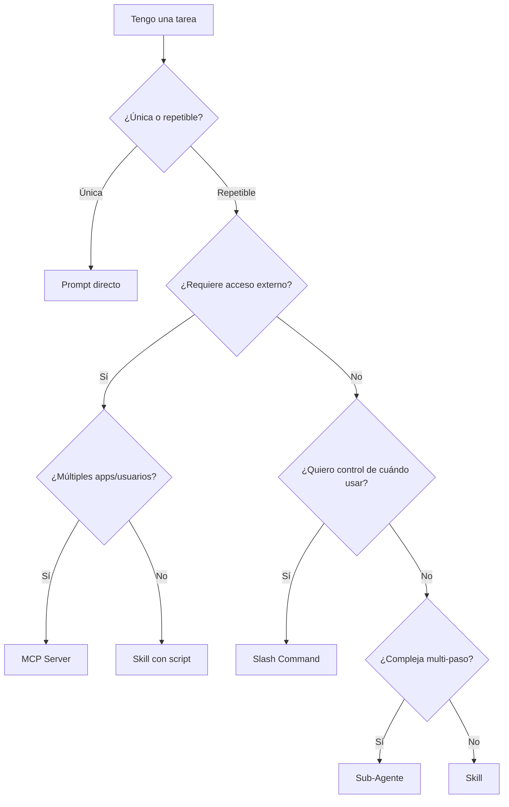

# Capítulo 15: Skills - La Pieza Final del Ecosistema

## Introducción: El Último Superpoder de Claude

Después de haber explorado comandos básicos, slash commands, MCP servers, agentes, hooks, y frameworks completos, finalmente llegamos a la feature más reciente de Claude Code: **Skills**.

Lanzada en octubre de 2025, Skills es la respuesta de Anthropic a una pregunta fundamental: **¿Cómo enseñarle a Claude workflows específicos de manera simple, reutilizable y eficiente en tokens?**

Si has estado atento durante el curso, podrías pensar: "Ya tenemos slash commands para workflows... ¿no son lo mismo?"

La respuesta corta: **No.**

Skills son fundamentalmente diferentes y, según algunos expertos como Simon Willison, podrían desencadenar **"una explosión Cámbrica de capacidades que hará que el rush de MCP se vea peatonal en comparación"**.

En este capítulo, descubrirás:
- Qué son Skills exactamente y cómo funcionan internamente
- Cómo crear tus propias Skills
- La comparación definitiva: Skills vs Slash Commands vs Prompts vs MCP vs Agentes
- Por qué Anthropic creó Skills cuando ya existían otras herramientas
- Cuándo usar cada mecanismo de extensibilidad
- Estrategias de integración entre todos estos sistemas

Prepárate: esta es la pieza que completa el puzzle del ecosistema Claude Code.

---

## 15.1 ¿Qué Son Skills? Definición y Conceptos Fundamentales

### Definición Oficial

**Skill** (en Claude Code) = Una carpeta que contiene:
1. **SKILL.md**: Archivo Markdown con YAML frontmatter e instrucciones
2. **Scripts opcionales**: Cualquier código ejecutable que la Skill necesite
3. **Recursos opcionales**: Archivos adicionales (templates, configs, etc.)

**Propósito**: Enseñarle a Claude un workflow repetible y especializado.

### Anatomía de un Skill

```
my-awesome-skill/
├── SKILL.md           # El cerebro del Skill (obligatorio)
├── script.py          # Script auxiliar (opcional)
├── template.md        # Template para generar docs (opcional)
└── REFERENCE.md       # Información suplementaria (opcional)
```

**SKILL.md** - Formato básico:
```markdown
---
name: My Awesome Skill
description: Brief description Claude uses to decide when to invoke this skill
version: 1.0.0
---

# My Awesome Skill

## Instructions

Provide clear, step-by-step guidance for Claude on how to execute this workflow.

## Examples

Show concrete examples to help Claude understand the expected output.
```

### Los Campos Obligatorios

**YAML Frontmatter** (primeras líneas del archivo):
- **name**: Nombre legible del Skill (máx 64 caracteres)
- **description**: **CRÍTICO** - Claude usa esto para decidir cuándo invocar la Skill (máx 200 caracteres)
- **version** (opcional): Para versionado

**Markdown Body**: Instrucciones detalladas de cómo ejecutar el workflow.

### Ubicación de Skills

**Skills Globales** (disponibles en todos los proyectos):
```
~/.claude/skills/my-skill/SKILL.md
```

**Skills de Proyecto** (solo disponibles en ese proyecto):
```
/path/to/project/.claude/skills/my-skill/SKILL.md
```

Claude busca Skills automáticamente en ambos lugares.

### El Mecanismo de "Progressive Disclosure"

Aquí está la magia que hace a Skills únicos:

**Paso 1**: Claude escanea **solo** los metadatos (name + description) de todas las Skills
- Esto consume **muy pocos tokens**
- Es como ver un catálogo de títulos de libros

**Paso 2**: Basándose en tu request, Claude decide qué Skills son relevantes

**Paso 3**: Claude carga **solo** las Skills relevantes completas
- Ahora sí lee todo el SKILL.md
- Ejecuta las instrucciones detalladas

**Resultado**: Eficiencia extrema en tokens.

**Comparación**:
- **Slash command**: Todas las instrucciones se cargan siempre que las usas
- **Skill**: Solo se carga cuando Claude determina que es relevante

### Ejemplo Conceptual

Imagina que tienes 50 Skills instalados:
1. **Generar Excel con fórmulas**
2. **Crear PowerPoint corporativo**
3. **Escribir documentación API**
4. **Optimizar consultas SQL**
5. **Crear diagramas Mermaid**
6. ... 45 más

**Usuario dice**: "Crea un diagrama de arquitectura de mi sistema"

**Claude piensa**:
- Escaneo: 50 Skills × ~30 tokens de metadata = 1,500 tokens
- "Crear diagramas Mermaid" parece relevante
- Cargo completo: +500 tokens
- **Total**: ~2,000 tokens

**Si fueran slash commands**:
- Tendrías que saber cuál comando invocar (`/create-diagram`?)
- O el sistema cargaría todos los 50 commands
- Claude no decide autónomamente qué usar

---

## 15.2 Cómo Crear Tu Primer Skill

### Método 1: Manual

**Paso 1**: Crea la estructura
```bash
mkdir -p ~/.claude/skills/my-first-skill
cd ~/.claude/skills/my-first-skill
touch SKILL.md
```

**Paso 2**: Escribe el SKILL.md
```markdown
---
name: Git Commit Message Generator
description: Generates conventional commit messages based on staged changes
version: 1.0.0
---

# Git Commit Message Generator

## Purpose
This skill helps create conventional commit messages following the format:
`type(scope): description`

## Instructions

1. Run `git diff --staged` to see changes
2. Analyze the changes to determine:
   - **Type**: feat, fix, docs, style, refactor, test, chore
   - **Scope**: affected module/component
   - **Description**: clear, concise summary
3. Generate commit message in format: `type(scope): description`
4. If changes are breaking, add `BREAKING CHANGE:` in body
5. Ask user for confirmation before committing

## Examples

### Example 1: New Feature
**Changes**: Added user authentication
**Output**: `feat(auth): add JWT-based user authentication`

### Example 2: Bug Fix
**Changes**: Fixed null pointer in payment processing
**Output**: `fix(payment): prevent null pointer exception in transaction handler`

### Example 3: Documentation
**Changes**: Updated README installation steps
**Output**: `docs(readme): update installation instructions`
```

**Paso 3**: Reinicia Claude Code o ejecuta comando de recarga (si existe)

**Paso 4**: Prueba
```
Usuario: "Help me create a commit message for my changes"
Claude: *Carga Git Commit Message Generator Skill y ejecuta workflow*
```

### Método 2: Usando "skill-creator" Skill

Anthropic provee un Skill meta que te ayuda a crear Skills:

```bash
# Instala skill-creator desde el marketplace
# (Ver sección 15.7 sobre marketplace)

# Luego en Claude Code:
Usuario: "I want to create a new Skill for optimizing SQL queries"

Claude: *Usa skill-creator*
"Great! Let me help you create that Skill. I'll ask you some questions:

1. What specific SQL optimization tasks should this Skill handle?
2. What database systems should it support (PostgreSQL, MySQL, etc.)?
3. Should it provide explanations for the optimizations?
..."

*Genera estructura completa del Skill*
```

El skill-creator:
- Hace preguntas sobre tu workflow
- Genera la estructura de carpeta
- Formatea el SKILL.md
- Incluye recursos que necesites

### Método 3: Clonar y Adaptar del Marketplace

```bash
# Clona el repositorio de skills de Anthropic
git clone https://github.com/anthropics/skills.git

# Explora skills de ejemplo
cd skills
ls

# Copia uno como template
cp -r template-skill ~/.claude/skills/my-new-skill
cd ~/.claude/skills/my-new-skill

# Edita SKILL.md según tus necesidades
```

### Best Practices para Crear Skills

#### 1. Description Descriptivo y Específico

**Malo**:
```yaml
description: Helps with documents
```
- Demasiado vago
- Claude no sabrá cuándo invocar

**Bueno**:
```yaml
description: Generates professional Excel spreadsheets with formulas, charts, and conditional formatting for financial reporting
```
- Específico sobre qué hace
- Incluye keywords que Claude puede matchear

#### 2. Instrucciones Claras y Paso a Paso

**Malo**:
```markdown
## Instructions
Create the report.
```

**Bueno**:
```markdown
## Instructions

1. **Gather Requirements**
   - Ask user for report type (financial, sales, inventory)
   - Confirm date range
   - Identify key metrics to include

2. **Fetch Data**
   - Use provided scripts to query database
   - Validate data completeness
   - Handle missing data gracefully

3. **Generate Report**
   - Apply formatting from template.xlsx
   - Insert calculated fields using formulas
   - Add charts for visualization

4. **Review & Export**
   - Show preview to user
   - Request confirmation
   - Export to specified format
```

#### 3. Ejemplos Concretos

Incluye ejemplos de:
- Inputs típicos
- Outputs esperados
- Edge cases

**Ejemplo**:
```markdown
## Examples

### Example 1: Standard Use Case
**Input**: "Generate monthly sales report for Q1 2025"
**Output**:
- Excel file with sheets: Summary, Details, Charts
- Formulas: SUM, AVERAGE, IF for calculations
- Pivot table for product categories
- Line chart showing monthly trends

### Example 2: Edge Case - No Data
**Input**: "Generate report for future date"
**Output**: Error message + suggestion to adjust date range
```

#### 4. Versionado

Mantén track de cambios:
```yaml
version: 1.2.0
```

Y documenta cambios en el archivo:
```markdown
## Changelog

### v1.2.0 (2025-10-20)
- Added support for custom date ranges
- Improved error handling for missing data

### v1.1.0 (2025-10-15)
- Added charts generation
- Fixed formula calculation bug

### v1.0.0 (2025-10-10)
- Initial release
```

---

## 15.3 Skills vs Slash Commands vs Prompts vs MCP vs Agentes

### La Gran Comparación

Ahora que conoces Skills, hagamos la comparación definitiva de **TODOS** los mecanismos de extensibilidad de Claude Code:

| Característica | Skills | Slash Commands | Prompts | MCP Servers | Sub-Agentes |
|----------------|--------|----------------|---------|-------------|-------------|
| **Invocación** | Automática por Claude | Manual por usuario (`/command`) | Manual (escribes prompt) | Automática (herramientas) | Manual (Task tool) |
| **Eficiencia Tokens** | ⭐⭐⭐⭐⭐ Progressive loading | ⭐⭐⭐ Carga completa | ⭐⭐ Depende longitud | ⭐⭐⭐⭐ Solo cuando se usa | ⭐⭐ Contexto completo |
| **Simplicidad** | ⭐⭐⭐⭐⭐ Markdown + YAML | ⭐⭐⭐⭐ Markdown | ⭐⭐⭐⭐⭐ Solo texto | ⭐⭐ Requiere servidor | ⭐⭐⭐ Configuración agent |
| **Portabilidad** | ⭐⭐⭐⭐⭐ Funciona otros LLMs | ⭐⭐⭐ Específico Claude Code | ⭐⭐⭐⭐⭐ Universal | ⭐⭐⭐⭐ Protocolo abierto | ⭐⭐ Específico Claude Code |
| **Complejidad Setup** | Muy baja | Muy baja | Ninguna | Media-Alta | Media |
| **Ejecución Código** | ✅ Sí (scripts) | ❌ No (solo prompts) | ❌ No | ✅ Sí (funciones) | ✅ Sí (full access) |
| **Acceso Externo** | ⚠️ Limitado | ❌ No | ❌ No | ✅ Sí (APIs, DBs) | ✅ Sí (via tools) |
| **Descubribilidad** | ⭐⭐⭐⭐⭐ Claude decide cuándo | ⭐⭐⭐ Lista en `/` menu | ⭐ Tienes que recordar | ⭐⭐⭐⭐ Tools disponibles | ⭐⭐⭐ Tienes que invocar |
| **Gobernanza** | ⭐⭐⭐ Archivos locales | ⭐⭐⭐ Archivos locales | ⭐⭐⭐⭐⭐ Ninguna | ⭐⭐⭐⭐⭐ Centralizada | ⭐⭐⭐⭐ Agent config |
| **Casos de Uso** | Workflows repetibles | Prompts frecuentes | Ad-hoc requests | Integraciones externas | Tareas complejas multi-paso |

### Cuándo Usar Cada Uno

#### Usa **Skills** cuando:
✅ Tienes un **workflow repetible** que quieres enseñar a Claude
✅ Quieres que Claude **decida autónomamente** cuándo usar el workflow
✅ Necesitas **eficiencia de tokens** (muchos Skills disponibles)
✅ El workflow es **especializado** pero usado frecuentemente
✅ Quieres **portabilidad** (usar mismo Skill con otros LLMs)

**Ejemplos**:
- Generar Excel con fórmulas específicas de tu empresa
- Crear documentación siguiendo tu style guide
- Optimizar SQL queries para tu base de datos específica
- Generar commit messages siguiendo convención de tu equipo

#### Usa **Slash Commands** cuando:
✅ Tienes un **prompt frecuente** que escribes muchas veces
✅ Quieres **invocación explícita** (tú decides cuándo usar)
✅ El comando es **simple** (solo texto, sin scripts)
✅ Necesitas **namespacing** (comandos organizados en jerarquías)
✅ Quieres **autocompletado** en el CLI

**Ejemplos**:
- `/review` - Revisar código con checklist específico
- `/explain` - Explicar código con nivel de detalle específico
- `/test` - Generar tests siguiendo tu framework preferido
- `/docs` - Generar documentación en formato específico

#### Usa **Prompts** (texto libre) cuando:
✅ La tarea es **única o ad-hoc**
✅ No necesitas repetir exactamente igual
✅ Máxima **flexibilidad**
✅ No vale la pena crear Skill o command

**Ejemplos**:
- "Explícame cómo funciona este algoritmo"
- "Refactoriza esta función para mejor legibilidad"
- "Sugiere nombres mejores para estas variables"

#### Usa **MCP Servers** cuando:
✅ Necesitas **acceso a sistemas externos** (APIs, bases de datos)
✅ Quieres **centralizar credenciales** y permisos
✅ Múltiples **aplicaciones/usuarios** comparten acceso
✅ Necesitas **gobernanza** y auditoría centralizada
✅ El servicio externo tiene **state** o **side effects**

**Ejemplos**:
- Acceso a base de datos PostgreSQL
- Integración con Slack para enviar mensajes
- Consultas a API de GitHub
- Acceso a almacenamiento cloud (S3, GCS)

#### Usa **Sub-Agentes** cuando:
✅ Tarea es **compleja y multi-paso**
✅ Requiere **autonomía** para explorar/investigar
✅ Beneficia de **especialización** (agente experto en área)
✅ Quieres **aislamiento de contexto** (para que no se mezcle)
✅ Puede correr **en paralelo** con tu trabajo actual

**Ejemplos**:
- Investigar todo el codebase para entender arquitectura
- Explorar opciones de librerías y comparar
- Realizar code review profundo de PR grande
- Buscar y corregir bugs en múltiples archivos

### Matriz de Decisión por Escenario

| Escenario | Mejor Opción | Por Qué |
|-----------|--------------|---------|
| "Quiero que Claude genere READMEs siguiendo el formato de mi empresa" | **Skill** | Workflow repetible, Claude decide cuándo aplicar |
| "Quiero un comando para revisar código antes de commits" | **Slash Command** | Invocación explícita antes de commits |
| "Necesito explicación de este algoritmo específico una vez" | **Prompt** | Ad-hoc, no se repetirá |
| "Quiero que Claude pueda consultar mi base de datos" | **MCP Server** | Acceso externo con credenciales |
| "Necesito investigar profundamente cómo funciona autenticación en todo el repo" | **Sub-Agente** | Tarea compleja, autónoma, beneficia de aislamiento |
| "Generar reportes financieros con formato Excel específico" | **Skill** | Workflow especializado repetible |
| "Crear commit message siguiendo conventional commits" | **Skill** o **Slash Command** | Skill si quieres auto-invocación, Command si prefieres control |
| "Enviar notificaciones a Slack cuando build falla" | **MCP Server** | Integración externa con side effects |
| "Buscar todos los usos de una función deprecada en codebase" | **Sub-Agente** | Búsqueda exhaustiva autónoma |

---

## 15.4 Por Qué Existen Skills: La Visión de Anthropic

### El Problema Que Resuelven

Antes de Skills, tenías una brecha:

**Opción 1: Prompts/Slash Commands**
- ✅ Simples de crear
- ❌ No pueden ejecutar código
- ❌ Claude no decide cuándo usar
- ❌ Ineficientes en tokens si tienes muchos

**Opción 2: MCP Servers**
- ✅ Pueden ejecutar código
- ✅ Acceso a servicios externos
- ❌ Complejos de configurar
- ❌ Requieren servidor corriendo
- ❌ No portables a otros LLMs

**Opción 3: Sub-Agentes**
- ✅ Autónomos y poderosos
- ❌ Overhead significativo
- ❌ No específicos a workflows repetibles
- ❌ Requieren invocación manual

**Skills llenan la brecha**:
- ✅ Simples como slash commands (Markdown + YAML)
- ✅ Pueden ejecutar código como MCP
- ✅ Auto-invocación como sub-agentes
- ✅ Eficiencia de tokens via progressive loading
- ✅ Portables a otros LLMs

### La Filosofía: "Enseñar, No Programar"

Anthropic diseñó Skills con una filosofía específica:

**No es**: Programar funciones que Claude ejecuta
**Es**: Enseñarle a Claude cómo hacer algo

**Comparación**:

**MCP (Programming paradigm)**:
```python
# Defines una función que Claude llama
@tool
def generate_excel_report(data, format):
    # Tu código Python que hace el trabajo
    workbook = create_workbook()
    # ... lógica compleja ...
    return workbook
```
- Tú programas la lógica
- Claude solo invoca tu función
- Claude no "aprende" cómo hacer reportes

**Skill (Teaching paradigm)**:
```markdown
## Instructions

1. Create a new Excel workbook
2. Add a sheet named "Summary"
3. In A1, write "Report Title"
4. Calculate totals using SUM formula: =SUM(B2:B100)
5. Format headers as bold with blue background
...
```
- Tú enseñas el proceso
- Claude ejecuta siguiendo instrucciones
- Claude "entiende" cómo hacer reportes
- Claude puede adaptar si el contexto varía ligeramente

### La Ventaja de "Teaching"

**Flexibilidad**: Si el usuario pide variación ("pero sin gráficos"), Claude puede adaptar porque entiende el proceso, no solo ejecuta función rígida.

**Transparencia**: Puedes leer el SKILL.md y entender exactamente qué hará Claude.

**Evolución**: Claude mejora con nuevas versiones del modelo; la Skill se beneficia automáticamente.

### La Predicción de Simon Willison

Simon Willison (creador de Datasette, experto en LLMs) escribió sobre Skills:

> "Skills are awesome, maybe a bigger deal than MCP... We'll see a Cambrian explosion in Skills which will make this year's MCP rush look pedestrian by comparison."

**Por qué predice esto**:

1. **Barrera de entrada bajísima**: Cualquiera que sepa Markdown puede crear Skills
2. **No requiere infraestructura**: No necesitas servidor, solo archivos
3. **Portabilidad**: Skills funcionan con cualquier LLM, no solo Claude
4. **Marketplace natural**: GitHub repo = marketplace instantáneo
5. **Ecosistema viral**: Fácil compartir, modificar, mejorar

**Comparación con MCP**:
- MCP requiere: Python/Node, servidor, configuración, debugging
- Skills requiere: Editor de texto

**Resultado esperado**: Explosión de Skills creados por comunidad, similar a lo que pasó con VS Code extensions o Chrome extensions.

---

## 15.5 El Marketplace de Skills

### El Repositorio Oficial: anthropics/skills

Anthropic mantiene un repositorio público de Skills:

**GitHub**: https://github.com/anthropics/skills

**Contenido actual** (octubre 2025):
- **template-skill**: Template para crear tus propias Skills
- **skill-creator**: Meta-Skill que te ayuda a crear Skills
- **excel-generator**: Genera Excel con fórmulas y formatos
- **powerpoint-generator**: Crea presentaciones PowerPoint profesionales
- **word-document**: Genera documentos Word con estilos
- **pdf-forms**: Crea PDFs rellenables
- **web-tester**: Testing automatizado de aplicaciones web
- **brand-guidelines**: Aplica guías de marca consistentemente

### Cómo Instalar Skills del Marketplace

#### Método 1: Clonar Repositorio Completo

```bash
# Clona el repo oficial
cd ~
git clone https://github.com/anthropics/skills.git

# Crea symlink para que Claude los encuentre
ln -s ~/skills ~/.claude/skills

# Claude ahora tiene acceso a todos los Skills
```

#### Método 2: Instalar Skills Individuales

```bash
# Crea directorio si no existe
mkdir -p ~/.claude/skills

# Clona solo el Skill específico que quieres
cd ~/.claude/skills
git clone https://github.com/anthropics/skills.git temp
cp -r temp/excel-generator ./
rm -rf temp

# Ahora tienes solo excel-generator instalado
```

#### Método 3: Via Plugin System (si disponible en tu versión)

Algunas versiones de Claude Code pueden tener integración directa:

```bash
# En Claude Code CLI
claude plugins install anthropics/skills/excel-generator

# Lista Skills instalados
claude skills list
```

### Otros Marketplaces Comunitarios

**awesome-claude-skills** (Travis VN):
- GitHub: https://github.com/travisvn/awesome-claude-skills
- Lista curada de Skills de comunidad
- Categorías: Development, Business, Creative, Data Science, etc.

**superpowers** (obra):
- GitHub: https://github.com/obra/superpowers
- Core skills library con enfoque en desarrollo
- Skills para testing, debugging, documentation, etc.

### Cómo Compartir Tus Skills

Si creaste un Skill útil:

1. **Publica en GitHub**:
```bash
cd ~/.claude/skills/my-awesome-skill
git init
git add .
git commit -m "Initial commit"
gh repo create my-awesome-skill --public --source=.
git push -u origin main
```

2. **Documenta bien el README**:
```markdown
# My Awesome Skill

## Description
Brief description of what this Skill does.

## Installation
\`\`\`bash
git clone https://github.com/youruser/my-awesome-skill.git ~/.claude/skills/my-awesome-skill
\`\`\`

## Usage
How to use this Skill with Claude Code.

## Examples
Concrete examples of the Skill in action.

## License
MIT License
```

3. **Contribuye a awesome-claude-skills**:
- Fork https://github.com/travisvn/awesome-claude-skills
- Agrega tu Skill en la categoría apropiada
- Submit PR

4. **Considera contribuir al repo oficial**:
- Si tu Skill es de alta calidad y general-purpose
- Submit issue/PR a anthropics/skills
- Puede ser incluido como Skill oficial

---

## 15.6 Integración de Skills con Otros Sistemas

### Skills + MCP: La Combinación Poderosa

Skills y MCP no son mutuamente excluyentes; se complementan:

**MCP provee**: Acceso a datos/servicios externos
**Skills proveen**: Conocimiento de workflows especializados

**Ejemplo: Skill de Reportes + MCP de PostgreSQL**

**SKILL.md** (sales-report Skill):
```markdown
---
name: Sales Report Generator
description: Generates comprehensive sales reports using database data
---

# Sales Report Generator

## Instructions

1. **Fetch Data**: Use PostgreSQL MCP to query sales data:
   - Query: SELECT * FROM sales WHERE date BETWEEN {start_date} AND {end_date}

2. **Calculate Metrics**:
   - Total revenue: SUM of sale_amount
   - Average order value: AVG of sale_amount
   - Top products: GROUP BY product_id, ORDER BY count DESC

3. **Generate Excel**:
   - Sheet 1: Summary with calculated metrics
   - Sheet 2: Detailed transactions
   - Sheet 3: Charts (line chart of daily revenue, pie chart of products)

4. **Export**: Save to reports/ directory with filename: sales_report_{date}.xlsx
```

**Flujo**:
1. Usuario: "Generate sales report for last month"
2. Claude carga "Sales Report Generator" Skill
3. Skill instruye usar MCP de PostgreSQL para fetch data
4. Skill provee workflow de cómo procesar y presentar data
5. Resultado: Excel report completo

**Ventaja**: MCP da acceso a datos, Skill da expertise de cómo crear reportes específicos de tu empresa.

### Skills + Slash Commands: Complementarios

Puedes tener ambos:

**Slash Command**: Invocación explícita rápida
```markdown
# .claude/commands/report.md

Generate a sales report for the specified period using our standard format.
```

**Skill**: Auto-invocación con lógica compleja
```markdown
---
name: Sales Report Skill
description: Generates sales reports with charts and analysis
---
...
```

**Uso**:
- Cuando quieres control: `/report last month`
- Cuando confías en Claude: "I need to analyze sales" → Claude usa Skill automáticamente

### Skills + Agentes: Agentes Especializados

Puedes crear sub-agentes que tengan Skills específicos:

**Ejemplo: Code Review Agent con Skills**

**.claude/agents/code-reviewer.md**:
```markdown
# Code Review Agent

You are a specialized code review agent with expertise in security, performance, and best practices.

**Available Skills**:
- security-audit-skill: Check for common vulnerabilities
- performance-analysis-skill: Identify performance bottlenecks
- style-checker-skill: Ensure code follows style guide

**Workflow**:
1. Read the code to review
2. Use security-audit-skill to check vulnerabilities
3. Use performance-analysis-skill to find bottlenecks
4. Use style-checker-skill to verify style compliance
5. Generate comprehensive review report
```

**Ventaja**: El agente es especializado y usa Skills para sub-tareas específicas.

### Skills en Frameworks (BMAD, SuperClaude, etc.)

Los frameworks pueden integrar Skills:

**En BMAD Method**:
- Agente QA podría usar "security-audit" Skill
- Agente Architect podría usar "diagram-generator" Skill
- Cada fase puede tener Skills específicos asociados

**En SuperClaude**:
- SuperClaude commands pueden invocar Skills internamente
- Token optimization se beneficia de progressive loading de Skills

**Estrategia**: Frameworks proveen estructura, Skills proveen expertise específico.

---

## 15.7 Ejemplos Prácticos: Creando Skills Útiles

### Ejemplo 1: Skill de Conventional Commits

**Caso de Uso**: Tu equipo sigue conventional commits, quieres que Claude siempre genere commits en ese formato.

**~/.claude/skills/conventional-commits/SKILL.md**:
```markdown
---
name: Conventional Commit Generator
description: Generates conventional commit messages following format type(scope): description
version: 1.0.0
---

# Conventional Commit Generator

## Purpose
Generate commit messages following conventional commits specification.

## Commit Types
- **feat**: New feature
- **fix**: Bug fix
- **docs**: Documentation changes
- **style**: Code style changes (formatting, etc.)
- **refactor**: Code refactoring
- **perf**: Performance improvement
- **test**: Adding or updating tests
- **build**: Build system or dependencies
- **ci**: CI configuration
- **chore**: Other changes (tooling, etc.)

## Format
```
type(scope): description

[optional body]

[optional footer]
```

## Instructions

1. **Analyze Changes**:
   - Run `git diff --staged` to see staged changes
   - Identify files modified and nature of changes

2. **Determine Type**:
   - Is it a new feature? → `feat`
   - Fixing a bug? → `fix`
   - Only documentation? → `docs`
   - Performance improvement? → `perf`
   - Other types as listed above

3. **Identify Scope**:
   - What module/component is affected?
   - Examples: auth, api, ui, database, etc.
   - If multiple, use most significant or omit scope

4. **Write Description**:
   - Start with lowercase verb
   - No period at end
   - Max 72 characters
   - Be clear and concise

5. **Add Body if Needed**:
   - Explain WHY the change was made
   - Describe any side effects
   - Wrap at 72 characters

6. **Add Footer if Breaking Change**:
   - If breaking change: `BREAKING CHANGE: description`
   - Reference issues: `Fixes #123`

7. **Present to User**:
   - Show generated commit message
   - Ask for confirmation
   - If approved, create commit with `git commit -m "message"`

## Examples

### Example 1: New Feature
**Staged Changes**: Added JWT authentication to API
**Generated Message**:
```
feat(auth): add JWT-based authentication to API

Implements token-based authentication using JSON Web Tokens.
Tokens expire after 24 hours and include user role claims.

Fixes #42
```

### Example 2: Bug Fix
**Staged Changes**: Fixed null pointer in payment processor
**Generated Message**:
```
fix(payment): prevent null pointer in transaction handler

Added null check before accessing transaction object.
```

### Example 3: Documentation
**Staged Changes**: Updated README installation section
**Generated Message**:
```
docs(readme): update installation instructions

Clarified Node.js version requirement and added troubleshooting section.
```

## Best Practices

- Keep description under 72 characters
- Use imperative mood ("add" not "added")
- Don't capitalize first letter of description
- Don't end description with period
- Body and footer are optional
- Use body to explain "why" not "what"
```

**Uso**:
```
Usuario: "Help me commit these changes"

Claude: *Carga Conventional Commit Generator Skill*

"I'll analyze your staged changes and generate a conventional commit message.

*Runs git diff --staged*

I see you've added a new user registration endpoint. Here's my suggested commit:

```
feat(api): add user registration endpoint

Implements POST /api/register with email validation and password hashing.
Returns JWT token on successful registration.

Fixes #156
```

Does this look good, or would you like me to adjust anything?"
```

### Ejemplo 2: Skill de Brand Guidelines

**Caso de Uso**: Tu empresa tiene guidelines estrictas de branding, quieres que Claude siempre las siga.

**~/.claude/skills/brand-guidelines/SKILL.md**:
```markdown
---
name: Company Brand Guidelines
description: Applies company brand guidelines to all content and documentation
version: 1.0.0
---

# Company Brand Guidelines

## Brand Identity

### Company Name
**Correct**: TechCorp
**Incorrect**: TechCorp., Tech Corp, techcorp

### Tone of Voice
- Professional but approachable
- Clear and concise
- Avoid jargon unless technical audience
- Use active voice
- Be positive and solution-oriented

### Color Palette
**Primary**: #0066CC (Blue)
**Secondary**: #00CC66 (Green)
**Accent**: #FF6600 (Orange)
**Neutral**: #333333 (Dark Gray), #F5F5F5 (Light Gray)

### Typography
**Headings**: Montserrat Bold
**Body**: Open Sans Regular
**Code**: Fira Code

## Content Guidelines

### Capitalization
- Product names: Always capitalize (TechCorp Cloud, DataSync Pro)
- Features: Sentence case (Real-time analytics, Advanced security)

### Terminology
**Use** | **Don't Use**
--------|---------------
client | customer
workflow | process
integration | connection
dashboard | control panel

### Documentation Structure
1. **Overview**: What it is
2. **Benefits**: Why it matters
3. **How it Works**: Step-by-step
4. **Examples**: Real use cases
5. **FAQ**: Common questions

## Visual Content

### Screenshots
- Always use full window, not cropped
- Include browser chrome showing URL
- Highlight relevant sections with red border (#FF0000)
- Add annotations with white background, dark text

### Diagrams
- Use company colors only
- Mermaid format preferred
- Left-to-right flow (not top-to-bottom)
- Include legend if using custom symbols

## Instructions

When creating any content:

1. **Check Tone**: Ensure professional but approachable
2. **Verify Terminology**: Use approved terms from table
3. **Apply Color Scheme**: Use brand colors in visuals
4. **Follow Structure**: Use documentation structure template
5. **Review Examples**: Reference examples in this Skill
6. **Capitalize Correctly**: Follow product name rules

## Examples

### Example: Product Description

**Bad**:
```
TechCorp's new tool lets customers connect their data easily.
```

**Good**:
```
TechCorp DataSync enables clients to integrate data sources seamlessly through our intuitive dashboard, providing real-time analytics for informed decision-making.
```

### Example: Documentation Header

**Bad**:
```
# How To Use The API

This doc shows you how to connect to our system...
```

**Good**:
```
# TechCorp API Integration Guide

## Overview
The TechCorp API enables seamless integration with your existing workflows...

## Benefits
- Real-time data synchronization
- Secure authentication with OAuth 2.0
...
```
```

**resources/logo.svg** (en la carpeta del Skill):
```xml
<!-- Company logo for inclusion in docs -->
<svg>...</svg>
```

**Uso**:
```
Usuario: "Write documentation for our new feature"

Claude: *Carga Company Brand Guidelines Skill*

"I'll create documentation following TechCorp's brand guidelines.

# TechCorp Real-Time Analytics

## Overview
TechCorp Real-Time Analytics transforms your data into actionable insights instantly...

[Continues following brand guidelines]
```

### Ejemplo 3: Skill de Code Review Checklist

**~/.claude/skills/code-review-checklist/SKILL.md**:
```markdown
---
name: Code Review Checklist
description: Comprehensive code review covering security, performance, and best practices
version: 2.0.0
---

# Code Review Checklist

## Purpose
Perform thorough code review following company standards.

## Review Categories

### 1. Security
- [ ] No hardcoded credentials or secrets
- [ ] Input validation on all user inputs
- [ ] SQL injection prevention (parameterized queries)
- [ ] XSS prevention (sanitize outputs)
- [ ] CSRF protection on state-changing operations
- [ ] Authentication and authorization checks
- [ ] Secure password handling (hashing, never plain text)
- [ ] HTTPS for all sensitive data transmission

### 2. Performance
- [ ] No N+1 query problems
- [ ] Appropriate indexes on database queries
- [ ] Caching strategy for expensive operations
- [ ] Lazy loading where appropriate
- [ ] No memory leaks (proper cleanup)
- [ ] Efficient algorithms (check time complexity)
- [ ] Pagination for large datasets

### 3. Code Quality
- [ ] Functions are small and focused (single responsibility)
- [ ] Meaningful variable and function names
- [ ] No magic numbers (use named constants)
- [ ] Consistent code style
- [ ] No commented-out code
- [ ] No console.log or debug statements
- [ ] Proper error handling (no silent failures)

### 4. Testing
- [ ] Unit tests for business logic
- [ ] Edge cases covered
- [ ] Test names are descriptive
- [ ] No flaky tests
- [ ] Mocks/stubs used appropriately
- [ ] Test coverage meets threshold (80%+)

### 5. Documentation
- [ ] Complex logic has comments explaining WHY
- [ ] Public APIs have documentation
- [ ] README updated if needed
- [ ] CHANGELOG updated with changes

### 6. Git Hygiene
- [ ] Commit messages are descriptive
- [ ] No merge commits in PR (rebase instead)
- [ ] No huge commits (split if needed)
- [ ] No commits with multiple unrelated changes

## Instructions

1. **Fetch Code**:
   - If PR number provided, fetch with `gh pr view {number}`
   - If files provided, read them

2. **Perform Review**:
   - Go through each category systematically
   - Check all items in checklist
   - Note violations with line numbers

3. **Categorize Issues**:
   - **CRITICAL**: Security issues, data loss, crashes
   - **MAJOR**: Performance problems, significant bugs
   - **MINOR**: Code quality, style issues

4. **Generate Report**:
   ```markdown
   # Code Review Report

   ## Summary
   [High-level assessment]

   ## Critical Issues
   1. [Issue with file:line reference]

   ## Major Issues
   1. [Issue with file:line reference]

   ## Minor Issues
   1. [Issue with file:line reference]

   ## Positive Notes
   [Things done well]

   ## Recommendation
   [APPROVE / REQUEST CHANGES / COMMENT]
   ```

5. **Provide Suggestions**:
   - For each issue, suggest fix
   - Provide code examples when helpful

## Example Review

**Code Reviewed**:
```python
# auth.py
def login(username, password):
    user = db.query(f"SELECT * FROM users WHERE username = '{username}'")
    if user.password == password:
        return create_token(user.id)
    return None
```

**Review Report**:
```markdown
# Code Review Report

## Summary
The authentication implementation has critical security vulnerabilities that must be addressed before merging.

## Critical Issues

1. **SQL Injection Vulnerability** (auth.py:3)
   - Using string interpolation for SQL query allows SQL injection
   - **Fix**: Use parameterized queries
   ```python
   user = db.query("SELECT * FROM users WHERE username = %s", (username,))
   ```

2. **Plain Text Password Comparison** (auth.py:4)
   - Passwords should never be stored or compared in plain text
   - **Fix**: Use bcrypt or similar for password hashing
   ```python
   if bcrypt.checkpw(password.encode(), user.password_hash):
   ```

## Major Issues

3. **No Input Validation** (auth.py:2)
   - Username should be validated (length, allowed characters)
   - **Fix**: Add validation before database query

## Recommendation
**REQUEST CHANGES** - Critical security issues must be fixed.

## Positive Notes
- Function is concise and focused
- Error handling returns None for failed login (good pattern)
```

## Best Practices

- Be constructive, not critical
- Explain WHY, not just WHAT
- Suggest solutions, don't just point out problems
- Acknowledge good code when you see it
- Prioritize issues (not everything is critical)
```

**Uso**:
```
Usuario: "Review PR #342"

Claude: *Carga Code Review Checklist Skill*

"I'll perform a comprehensive code review using our company checklist.

*Fetches PR, analyzes code*

# Code Review Report for PR #342

## Summary
The implementation is solid overall, with good test coverage. However, there are two critical security issues that must be addressed.

[Continues with detailed review...]
```

---

## 15.8 Advanced Skills: Técnicas Avanzadas

### Técnica 1: Skills con Scripts Ejecutables

Skills pueden incluir scripts que Claude ejecuta:

**~/.claude/skills/db-optimizer/SKILL.md**:
```markdown
---
name: Database Query Optimizer
description: Analyzes and optimizes SQL queries for performance
---

# Database Query Optimizer

## Instructions

1. Receive SQL query from user
2. Run `python analyze_query.py "{query}"` to get execution plan
3. Identify bottlenecks:
   - Missing indexes
   - Full table scans
   - Inefficient JOINs
4. Generate optimized version
5. Run `python compare_performance.py "{original}" "{optimized}"` to show improvement
6. Present results to user
```

**~/.claude/skills/db-optimizer/analyze_query.py**:
```python
#!/usr/bin/env python3
import sys
import sqlparse

def analyze_query(query):
    # Parse SQL
    parsed = sqlparse.parse(query)[0]

    # Extract tables
    tables = extract_tables(parsed)

    # Check for issues
    issues = []
    if has_select_star(parsed):
        issues.append("Using SELECT * - specify columns instead")
    if has_missing_where(parsed):
        issues.append("No WHERE clause - may return too many rows")

    # Return analysis
    return {
        "tables": tables,
        "issues": issues,
        "suggestions": generate_suggestions(issues)
    }

if __name__ == "__main__":
    query = sys.argv[1]
    result = analyze_query(query)
    print(json.dumps(result, indent=2))
```

**Ventaja**: Claude puede ejecutar lógica compleja sin tener que implementarla en el prompt.

### Técnica 2: Skills con Templates

**~/.claude/skills/api-docs-generator/SKILL.md**:
```markdown
---
name: API Documentation Generator
description: Generates OpenAPI/Swagger documentation from code
---

# API Documentation Generator

## Instructions

1. Analyze API endpoints in codebase
2. For each endpoint, extract:
   - HTTP method
   - Path
   - Parameters
   - Request body schema
   - Response schema
   - Description
3. Use template.yaml as base
4. Generate complete OpenAPI spec
5. Validate with `python validate_openapi.py`
6. Save to docs/api.yaml
```

**~/.claude/skills/api-docs-generator/template.yaml**:
```yaml
openapi: 3.0.0
info:
  title: {{API_TITLE}}
  version: {{API_VERSION}}
  description: {{API_DESCRIPTION}}

servers:
  - url: {{SERVER_URL}}
    description: {{SERVER_DESCRIPTION}}

paths:
  # Paths will be generated here

components:
  schemas:
    # Schemas will be generated here
```

**Uso**: Claude rellena el template con información extraída del código.

### Técnica 3: Skills Encadenados

Un Skill puede invocar otro Skill:

**~/.claude/skills/full-deployment/SKILL.md**:
```markdown
---
name: Full Deployment Pipeline
description: Executes complete deployment from tests to production
---

# Full Deployment Pipeline

## Instructions

1. **Run Tests**: Use "test-runner" Skill to run all tests
2. **Check Tests**: If tests fail, stop and report errors
3. **Build**: Use "builder" Skill to create production build
4. **Security Scan**: Use "security-scanner" Skill to check for vulnerabilities
5. **Deploy**: Use "deployer" Skill to deploy to staging
6. **Smoke Tests**: Use "smoke-test" Skill on staging
7. **Promote**: If all pass, promote to production
8. **Notify**: Send notification via Slack MCP

## Example Flow

User: "Deploy to production"
→ Triggers this Skill
→ Runs test-runner Skill
→ Runs builder Skill
→ Runs security-scanner Skill
→ Runs deployer Skill (staging)
→ Runs smoke-test Skill
→ Runs deployer Skill (production)
→ Sends Slack notification
→ Reports completion to user
```

**Ventaja**: Workflows complejos multi-skill orquestados.

### Técnica 4: Skills Contextuales

Skills que se adaptan al contexto del proyecto:

**~/.claude/skills/smart-test-generator/SKILL.md**:
```markdown
---
name: Smart Test Generator
description: Generates tests using the project's testing framework automatically
---

# Smart Test Generator

## Instructions

1. **Detect Framework**:
   - Check package.json for dependencies:
     - If "jest" present → Use Jest
     - If "mocha" present → Use Mocha
     - If "pytest" present → Use Pytest
   - Check for existing test files to confirm

2. **Detect Patterns**:
   - Read 2-3 existing test files
   - Identify naming conventions (describe/it vs test_*)
   - Identify assertion style (expect vs assert)
   - Identify mocking approach

3. **Generate Tests**:
   - Follow detected patterns
   - Use same assertion style
   - Match existing file structure

4. **Validate**:
   - Run tests with framework's test runner
   - Ensure they pass
   - Fix any issues

## Example

**Detected**: Jest with expect assertions
**Generated**:
```javascript
describe('UserService', () => {
  it('should create user with valid data', () => {
    const user = userService.create({ name: 'John', email: 'john@example.com' });
    expect(user).toBeDefined();
    expect(user.name).toBe('John');
  });
});
```

**Detected**: Pytest with assert
**Generated**:
```python
def test_user_service_create():
    user = user_service.create(name='John', email='john@example.com')
    assert user is not None
    assert user.name == 'John'
```
```

**Ventaja**: Mismo Skill funciona en diferentes proyectos con diferentes setups.

---

## 15.9 Skills: Best Practices y Errores Comunes

### Best Practices

#### 1. Description es Crítico

**Malo**:
```yaml
description: Helps with things
```

**Bueno**:
```yaml
description: Optimizes PostgreSQL queries by adding indexes and rewriting inefficient JOINs for 10x performance improvement
```

**Por qué**: Claude usa description para decidir cuándo invocar. Específico = mejor matching.

#### 2. Instrucciones Step-by-Step

**Malo**:
```markdown
## Instructions
Generate the report.
```

**Bueno**:
```markdown
## Instructions

1. **Gather Data**:
   - Ask user for date range
   - Query database using MCP
   - Validate completeness

2. **Process**:
   - Calculate metrics (revenue, avg order, etc.)
   - Identify trends
   - Flag anomalies

3. **Format**:
   - Use Excel template
   - Apply formulas
   - Add charts

4. **Review**:
   - Show preview
   - Get confirmation
   - Export
```

**Por qué**: Claude sigue instrucciones mejor cuando son paso a paso.

#### 3. Incluir Ejemplos

**Malo**: Solo instrucciones, sin ejemplos

**Bueno**: Instrucciones + 2-3 ejemplos concretos de input → output

**Por qué**: Ejemplos reducen ambigüedad, Claude aprende el patrón esperado.

#### 4. Versionado Semántico

```yaml
version: 1.2.0
```

- Major (1.x.x): Cambios incompatibles
- Minor (x.2.x): Nueva funcionalidad compatible
- Patch (x.x.0): Bug fixes

**Por qué**: Permite tracking de cambios y rollback si algo falla.

#### 5. Documenta Dependencias

Si tu Skill requiere MCP servers, scripts, o herramientas:

```markdown
## Requirements

- PostgreSQL MCP server configured
- Python 3.8+ with pandas library
- Excel template in resources/template.xlsx
```

**Por qué**: Usuario sabe qué necesita instalar para que Skill funcione.

### Errores Comunes

#### Error 1: Description Demasiado Genérico

**Síntoma**: Skill no se invoca cuando debería

**Causa**:
```yaml
description: Helps with documents
```

**Fix**:
```yaml
description: Generates financial reports in Excel with pivot tables and charts for quarterly revenue analysis
```

#### Error 2: Instrucciones Ambiguas

**Síntoma**: Claude produce output inconsistente o incorrecto

**Causa**:
```markdown
## Instructions
Create a nice report.
```

**Fix**: Ser específico sobre cada paso, formato, y expectations.

#### Error 3: Olvidar Code Execution

**Síntoma**: Scripts en Skill no se ejecutan

**Causa**: Code execution no habilitado en settings

**Fix**: Settings > Capabilities > Code Execution → ON

#### Error 4: Paths Relativos Incorrectos

**Síntoma**: Skill no encuentra recursos (templates, scripts)

**Causa**:
```python
# En script.py
with open("template.xlsx", "r") as f:  # ❌ Wrong
```

**Fix**:
```python
import os

skill_dir = os.path.dirname(__file__)
template_path = os.path.join(skill_dir, "template.xlsx")
with open(template_path, "r") as f:  # ✅ Correct
```

#### Error 5: Skills Demasiado Amplios

**Síntoma**: Skill intenta hacer demasiado, resultados mediocres

**Causa**: Un Skill que hace "todo de documentación"

**Fix**: Divide en múltiples Skills específicos:
- `api-docs-generator`
- `user-manual-writer`
- `readme-creator`

**Regla**: Un Skill = Un workflow específico

---

## 15.10 El Futuro de Skills

### Predicciones Basadas en Tendencias

#### 1. Skills Marketplace con Ratings

Similar a VS Code Extensions:
- Marketplace con búsqueda y filtros
- Ratings y reviews de comunidad
- Download counts
- Featured Skills

**Timeline esperado**: 6-12 meses (mid-2026)

#### 2. Skills con UI Interactiva

Skills que pueden generar interfaces gráficas:
```markdown
## Instructions
1. Generate interactive form with fields: Name, Email, Role
2. Display form to user
3. On submit, validate data
4. Save to database via MCP
```

**Timeline esperado**: 12-18 meses (late 2026)

#### 3. Skills Colaborativos

Multiple Skills trabajando juntos automáticamente:
- Skill A identifica problema
- Skill B investiga causa raíz
- Skill C propone solución
- Skill D implementa y testa

**Timeline esperado**: 18-24 meses (2027)

#### 4. Skills con Machine Learning

Skills que aprenden de uso:
- Track qué ajustes hace el usuario
- Adaptan behavior basándose en feedback
- Mejoran con el tiempo

**Timeline esperado**: 24+ meses (2027+)

### Comparación con Ecosistemas Previos

**Skills seguirán el camino de**:

**VS Code Extensions**:
- Inicio: Pocos extensions oficiales
- Crecimiento: Explosión de community extensions
- Madurez: Thousands de extensions, curated marketplace
- **Timeline**: 3-4 años desde launch

**Chrome Extensions**:
- Similar pattern
- Ahora: Millones de usuarios usando extensions diariamente
- **Timeline**: 4-5 años hasta madurez

**Predicción para Skills**:
- **2026**: Cientos de Skills comunitarios
- **2027**: Miles de Skills, marketplace maduro
- **2028**: Skills son standard, casi todos los developers los usan

### Oportunidades

Si estás leyendo esto en 2025-2026, estás **temprano** en la curva de adopción.

**Oportunidad**:
- Crea Skills de alta calidad temprano
- Conviértete en conocido en el ecosistema
- Cuando Skills explote en popularidad, ya tienes reputation

Similar a early adopters de:
- YouTube (early creators dominan hasta hoy)
- App Store (early apps ganaron big)
- NPM packages (early packages se volvieron standards)

**Acción sugerida**:
1. Identifica un nicho que conoces bien
2. Crea 3-5 Skills de alta calidad en ese nicho
3. Documenta excelentemente
4. Comparte en comunidad
5. Itera basándose en feedback

**Resultado esperado**: Cuando Skills se vuelva mainstream, tus Skills ya tienen adoption y trust.

---

## 15.11 Conclusión: Skills Como Pieza Final

### El Ecosistema Completo

Ahora tienes **todas** las piezas del ecosistema Claude Code:

1. **Comandos Básicos**: Read, Write, Edit, Bash
2. **Operaciones de Archivos**: Glob, Grep
3. **Git Integration**: Commits, PRs, branches
4. **Slash Commands**: Prompts frecuentes automatizados
5. **MCP Servers**: Acceso a servicios externos
6. **Sub-Agentes**: Tareas complejas autónomas
7. **Hooks**: Automatización de eventos
8. **Output Styles**: Personalización de respuestas
9. **Frameworks**: BMAD, SuperClaude, Claude Flow
10. **Skills**: Workflows especializados enseñados a Claude

### Cuándo Usar Qué: Guía Rápida de Decisión



### La Filosofía Unificadora

Todos estos mecanismos comparten una filosofía:

**"Enseñar a Claude cómo trabajas, no forzarte a trabajar como Claude espera"**

- **Slash Commands**: Enseñan prompts que usas frecuentemente
- **Skills**: Enseñan workflows especializados
- **MCP Servers**: Enseñan cómo acceder tus sistemas
- **Sub-Agentes**: Enseñan expertise especializada
- **Hooks**: Enseñan cuándo automatizar
- **Frameworks**: Enseñan metodologías completas

**Resultado**: Claude se adapta a ti, no al revés.

### Tu Próximo Paso

**Desafío Final**:

Crea tu primer Skill en las próximas 24 horas:

1. Identifica un workflow que haces frecuentemente
2. Crea una carpeta en `~/.claude/skills/my-first-skill/`
3. Escribe `SKILL.md` con:
   - Name y description claros
   - Instrucciones paso a paso
   - Al menos un ejemplo concreto
4. Prueba con Claude Code
5. Itera basándote en resultados

**No tiene que ser perfecto. Solo tiene que existir.**

El mejor momento para crear tu primer Skill fue cuando se lanzaron en octubre 2025.
El segundo mejor momento es ahora.

---

## Examen 15: Maestría de Skills

### Parte 1: Conceptos Fundamentales (30 puntos)

1. **Explica "progressive disclosure"** en el contexto de Skills y por qué es importante para eficiencia de tokens. (10 puntos)

2. **Compara Skills vs MCP Servers**: ¿Cuándo usarías uno vs el otro? Da 2 escenarios específicos para cada uno. (10 puntos)

3. **¿Por qué el campo `description` es crítico** en SKILL.md? ¿Qué pasa si es demasiado genérico? (10 puntos)

### Parte 2: Creación de Skills (40 puntos)

4. **Crea un Skill completo** para el siguiente caso de uso: (40 puntos)

**Caso de Uso**: Tu equipo hace code reviews antes de cada merge. Quieres un Skill que:
- Verifique que todos los tests pasen
- Revise que el código siga tu style guide
- Compruebe que hay al menos 80% code coverage
- Genere un report de review

Escribe el `SKILL.md` completo con:
- YAML frontmatter apropiado
- Instrucciones detalladas paso a paso
- Al menos 2 ejemplos (uno de código que pasa review, otro que no)

### Parte 3: Integración Avanzada (30 puntos)

5. **Diseña una arquitectura** que integre Skills + MCP + Sub-Agentes para el siguiente proyecto: (30 puntos)

**Proyecto**: Sistema automatizado de deployment que:
- Conecta a GitHub (MCP)
- Corre tests
- Hace security scan
- Deploya a staging
- Corre smoke tests
- Si todo pasa, deploya a production
- Notifica al equipo via Slack (MCP)

Especifica:
- Qué harías con Skills (y cuáles)
- Qué harías con MCP Servers (y cuáles)
- Qué harías con Sub-Agentes (si aplica)
- Cómo se integrarían todos

---

**Fin del Capítulo 15**

Ahora posees comprensión completa del ecosistema Claude Code.

**De principiante a maestro**:
- Capítulo 1: `claude help`
- Capítulo 15: Sistemas integrados de Skills + MCP + Agentes + Frameworks

Has recorrido un largo camino. **¡Felicidades!**
